# 🔋 중고 배터리 셀 용량(Capacity) 예측 모델 개발 종합 보고서

> **프로젝트**: 중고 배터리 셀의 초기 측정 데이터 기반 실제 방전 용량 예측  
> **작성일**: 2026년 2월 21일  
> **데이터**: BS-LSBAT-S240629 배치, 1,040개 배터리 셀  
> **분석 환경**: Python 3.14.2 · XGBoost 3.2.0 · LightGBM 4.6.0 · Optuna 4.7.0 · scikit-learn 1.8.0

---

## 목차

1. [Phase 1: 데이터 탐색 및 분석 (EDA)](#phase-1-데이터-탐색-및-분석-eda)
2. [Phase 2: 파생변수 생성 (Feature Engineering)](#phase-2-파생변수-생성-feature-engineering)
3. [Phase 3: 데이터 전처리 및 피처 선택](#phase-3-데이터-전처리-및-피처-선택)
4. [Phase 4: 최종 학습 데이터 구성](#phase-4-최종-학습-데이터-구성)
5. [Phase 5: 모델 학습 및 평가](#phase-5-모델-학습-및-평가)
6. [Phase 7: Knowledge Distillation](#phase-7-knowledge-distillation)
7. [Phase 8: 성능 고도화 실험](#phase-8-성능-고도화-실험)
8. [Phase 9: S1 집중 개선](#phase-9-s1-집중-개선)
9. [Phase 10: KD 정보채널 보완](#phase-10-kd-정보채널-보완)
10. [종합 결론 및 실무 제언](#종합-결론-및-실무-제언)

---

# Phase 1: 데이터 탐색 및 분석 (EDA)

중고 배터리 셀의 초기 측정 데이터(전압, AC 임피던스)로부터 실제 방전 용량(Capacity)을 예측하기 위한 탐색적 데이터 분석입니다.

---

## 1-1. 라이브러리 로드 및 환경 설정

```python
import pandas as pd, numpy as np, matplotlib.pyplot as plt, seaborn as sns
from scipy import stats
plt.rcParams['font.family'] = 'Malgun Gothic'
plt.rcParams['axes.unicode_minus'] = False
COLORS = sns.color_palette('husl', 10)
```

**사용 라이브러리:**

| 라이브러리 | 용도 |
|---|---|
| `pandas` | 데이터프레임 조작 |
| `numpy` | 수치 연산 |
| `matplotlib` / `seaborn` | 시각화 |
| `scipy.stats` | 통계 검정 (Z-score 등) |

> ✅ 모든 라이브러리 정상 로드, 한글 폰트(`Malgun Gothic`) 설정 완료

---

## 1-2. 데이터 로드 및 컬럼 정리

```python
raw = pd.read_csv('./data.csv')
# 컬럼 이름 재정의 → 라벨/빈 컬럼 제거 → 수치형 변환
```

**출력:**
```
데이터 Shape: (1040, 10)
피처 목록: ['initial_voltage', 'initial_impedance', 'v42_voltage', 'v42_impedance',
            'v25_voltage', 'v25_impedance', 'v36_voltage', 'v36_impedance']
타겟: capacity
```

**데이터 상위 5행 (df.head()):**

| cell_id | initial_voltage | initial_impedance | v42_voltage | v42_impedance | v25_voltage | v25_impedance | v36_voltage | v36_impedance | capacity |
|---------|-----------------|-------------------|-------------|---------------|-------------|---------------|-------------|---------------|----------|
| BS-LSBAT-S240629-0001 | 3.4552 | 11.39 | 4.1774 | 10.56 | 2.9610 | 10.55 | 3.5900 | 11.08 | 4.976 |
| BS-LSBAT-S240629-0002 | 3.4546 | 11.61 | 4.1779 | 10.70 | 2.9772 | 10.75 | 3.5900 | 10.62 | 5.012 |
| BS-LSBAT-S240629-0003 | 3.4554 | 10.97 | 4.1779 | 10.42 | 2.9656 | 10.65 | 3.5900 | 10.87 | 5.000 |
| BS-LSBAT-S240629-0004 | 3.4570 | 10.93 | 4.1782 | 10.31 | 2.9663 | 10.71 | 3.5900 | 10.73 | 5.004 |
| BS-LSBAT-S240629-0005 | 3.4555 | 11.24 | 4.1774 | 10.52 | 2.9714 | 11.12 | 3.5900 | 10.97 | 5.009 |

**해석:**
- **데이터 크기**: 1,040개 셀 × 10개 컬럼 (cell_id + 8개 피처 + 1개 타겟)
- **피처 구성**: 4개 측정 구간(Initial, 4.2V, 2.5V, 3.6V) × 2개 측정값(전압, 임피던스) = **8개 원본 피처**
- **셀 ID 패턴**: `BS-LSBAT-S240629-XXXX` 형식으로 동일 배치의 배터리 셀

| 구간 | 의미 | 전압 대표값 | 임피던스 대표값 |
|---|---|---|---|
| Initial (OCV) | 초기 개방회로전압 | 3.455~3.457V | 10.93~11.61mΩ |
| 4.2V (Full) | 만충 상태 | 4.177~4.178V | 10.31~10.56mΩ |
| 2.5V (Cut-off) | 방전 종지 | 2.961~2.977V | 10.55~11.12mΩ |
| 3.6V (Nominal) | 공칭 전압 부근 | 3.59V | 10.62~11.08mΩ |

---

## 1-3. 기본 통계 분석

```python
stats_df = df[numeric_cols].describe().T
stats_df['missing'] = df[numeric_cols].isnull().sum()
stats_df['skewness'] = df[numeric_cols].skew()
stats_df['kurtosis'] = df[numeric_cols].kurtosis()
```

**출력 (기본 통계 요약 테이블):**

| 피처 | mean | std | min | max | missing | skew | kurtosis |
|------|------|-----|-----|-----|---------|------|----------|
| initial_voltage | 3.4560 | 0.0018 | 3.4512 | 3.4622 | 0 | 0.44 | 0.19 |
| initial_impedance | 11.40 | 0.82 | 9.47 | 14.14 | 0 | 0.23 | -0.28 |
| v42_voltage | 4.1780 | 0.0030 | 4.1705 | 4.1940 | 0 | 2.65 | 8.41 |
| v42_impedance | 10.67 | 0.40 | 9.79 | 12.16 | 0 | 0.69 | 0.25 |
| v25_voltage | 2.9700 | 0.0216 | 2.8922 | 3.0282 | 0 | -0.17 | -0.44 |
| v25_impedance | 10.81 | 0.32 | 9.88 | 11.86 | 0 | 0.05 | -0.10 |
| v36_voltage | 3.5899 | 0.0007 | 3.5852 | 3.5930 | 0 | -2.42 | 27.07 |
| v36_impedance | 11.89 | 31.59 | 10.14 | 1032.0 | 0 | 32.24 | 1040.0 |
| **capacity** | **5.026** | **0.033** | **4.792** | **5.097** | **0** | **-2.16** | **7.84** |

**핵심 해석:**
1. **결측치**: 전체 0개 → 별도의 결측값 처리 불필요
2. **v42_voltage** / **v36_voltage**: 표준편차가 매우 작음 → 사실상 상수에 가까움
3. **v25_voltage**: 상대적으로 변동성이 높아 **셀 간 차이를 가장 잘 반영**
4. **v36_impedance**: min 10.14 / max 1032.0 → **극단 이상치 1개 존재** (std=31.59)
5. **Capacity (타겟)**: 평균 5.026 Ah, 표준편차 0.033 Ah, 범위 4.792~5.097 → **약 6% 이내의 매우 좁은 변동**
6. Capacity의 음의 왜도(skew=-2.16): **왼쪽 꼬리 분포** — 대부분 공칭 용량에 가깝고, 일부 열화 셀은 낮은 값

---

## 1-4. 분포 시각화 (히스토그램 + KDE)

```python
fig, axes = plt.subplots(3, 3, figsize=(18, 14))
for i, col in enumerate(numeric_cols):
    ax.hist(data, bins=50, alpha=0.6, density=True)
    data.plot.kde(ax=ax, color='black', linewidth=1.5)
    ax.axvline(data.mean(), color='red', linestyle='--')   # 평균
    ax.axvline(data.median(), color='blue', linestyle='--')  # 중앙값
plt.savefig('./eda_01_distributions.png')
```

**📊 시각화:** `eda_01_distributions.png`

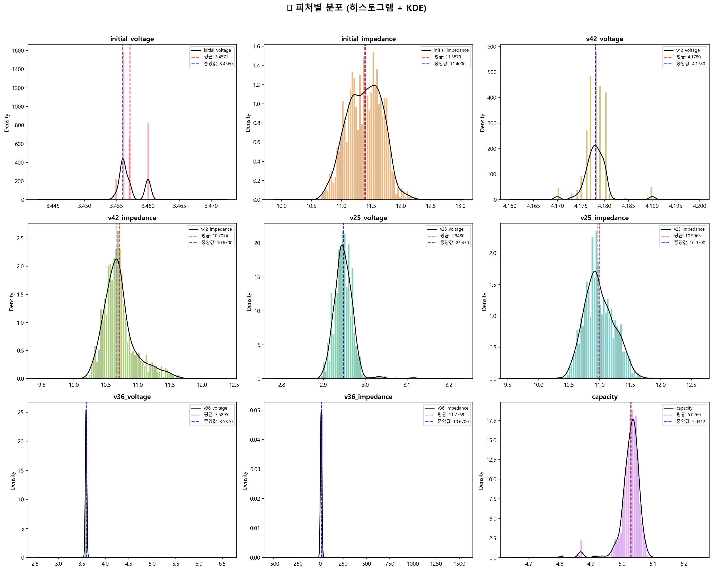

**각 피처 분포 특성:**

| 피처 | 분포 형태 | 특이사항 |
|---|---|---|
| `initial_voltage` | 정규분포에 가까움 | 평균 3.456V 부근 집중 |
| `initial_impedance` | 오른쪽 꼬리 분포 | 일부 높은 임피던스 값 존재 |
| `v42_voltage` | 매우 좁은 범위 집중 | 4.178V 부근에 밀집, 사실상 상수 |
| `v42_impedance` | 오른쪽 꼬리 | 대부분 10~11mΩ, 일부 높은 값 |
| `v25_voltage` | **가장 넓은 분포** | **셀 열화 차이를 가장 잘 반영** |
| `v25_impedance` | 정규분포에 가까움 | 10~11mΩ 범위 |
| `v36_voltage` | 좁은 범위 | 3.59V 부근 밀집 |
| `v36_impedance` | 정규분포에 가까움 | 10~11mΩ (극단 이상치 1개 제외) |
| `capacity` | 왼쪽 꼬리 | 대부분 5.0Ah 이상, 일부 열화 셀 4.8Ah 이하 |

> **핵심**: `v42_voltage`와 `v36_voltage`는 변동성이 거의 없어 예측 기여도가 낮을 것으로 예상. 반면 `v25_voltage`는 가장 넓은 분포로 예측 변수로서 가장 유망.

---

## 1-5. 박스플롯 (이상치 확인)

```python
fig, axes = plt.subplots(3, 3, figsize=(18, 12))
for i, col in enumerate(numeric_cols):
    bp = ax.boxplot(df[col].dropna(), patch_artist=True)
    # IQR 이상치 수 표시
plt.savefig('./eda_02_boxplots.png')
```

**📊 시각화:** `eda_02_boxplots.png`

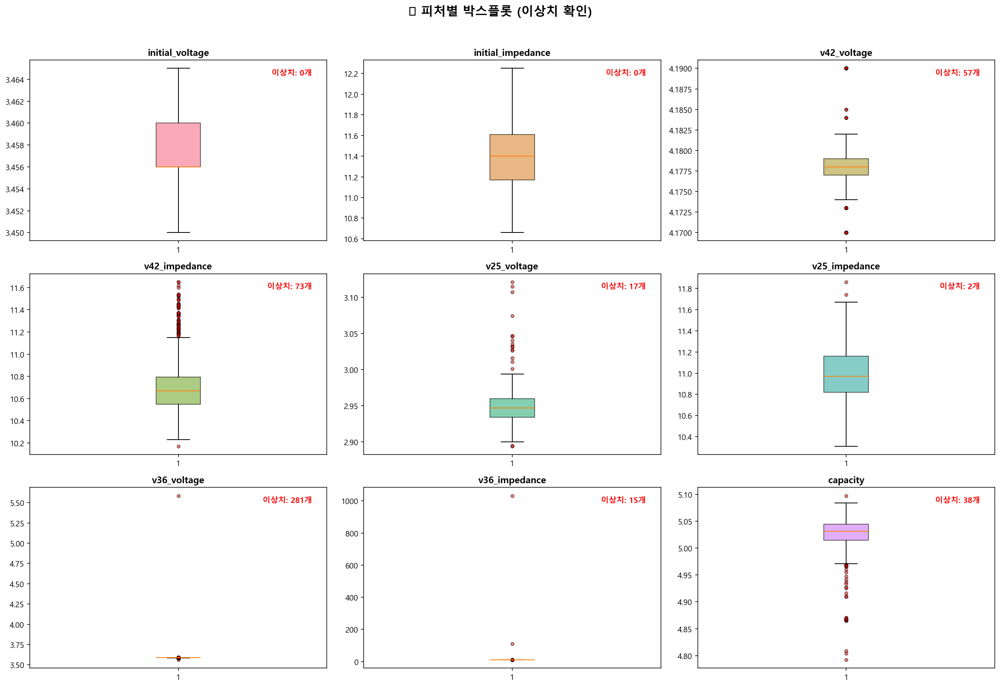

**해석:**
- **`v42_voltage`**: 박스가 매우 좁고 위스커 밖에 다수의 이상치 → 대부분 4.178V에 밀집
- **`v42_impedance`**: 위쪽 이상치 다수 → 일부 셀의 내부저항이 충전 후에도 높게 유지
- **`v36_voltage`**: 가장 많은 이상치 → 분포가 매우 좁아 IQR이 작기 때문에 과도 검출
- **`capacity`**: 아래쪽 이상치 → 공칭 용량보다 현저히 낮은 열화 셀

> **주의**: IQR 기반 이상치는 분포가 좁은 피처에서 과도하게 검출될 수 있으므로, **도메인 지식 기반** 판단이 병행되어야 합니다.

---

## 1-6. 상관분석 (Pearson / Spearman)

```python
fig, axes = plt.subplots(1, 2, figsize=(20, 8))
# Pearson 상관계수 히트맵
sns.heatmap(pearson_corr, mask=mask, annot=True, fmt='.3f', cmap='RdBu_r', ...)
# Spearman 상관계수 히트맵
sns.heatmap(spearman_corr, mask=mask, annot=True, fmt='.3f', cmap='RdBu_r', ...)
plt.savefig('./eda_03_correlation.png')
```

**📊 시각화:** `eda_03_correlation.png`


**Pearson vs Spearman 비교:**

| 관찰 결과 | 내용 |
|---|---|
| 임피던스 피처 간 | 높은 양의 상관관계 → **다중공선성** 우려 (같은 물리량을 다른 조건에서 측정) |
| 전압 피처 간 | 일부 높은 상관, 일부 약한 상관 |
| 전압 ↔ 임피던스 | 뚜렷한 상관 → 전극 열화: 전압↓, 임피던스↑ |
| Pearson ≈ Spearman | 대체로 유사 → 대부분 **선형 관계**가 지배적 |

---

### Capacity와의 상관계수 순위

```python
corr_with_target = pd.DataFrame({
    'Pearson': pearson_corr[TARGET].drop(TARGET),
    'Spearman': spearman_corr[TARGET].drop(TARGET),
}).sort_values('|Pearson|', ascending=False)
```

**출력 (Capacity 상관계수 테이블 - 절대값 내림차순):**

| 순위 | 피처 | Pearson r | |Pearson| | |Spearman| | 해석 |
|---|---|---|---|---|---|
| 1 | `v25_voltage` | **-0.5952** | **0.5952** | 0.5842 | 🟢 **가장 강한 상관** |
| 2 | `v25_impedance` | -0.2130 | 0.2130 | 0.2150 | 🟡 보통 |
| 3 | `v42_impedance` | -0.1773 | 0.1773 | 0.1760 | 🟡 보통 |
| 4 | `initial_impedance` | -0.1499 | 0.1499 | 0.1399 | 🔴 약함 |
| 5 | `initial_voltage` | +0.1365 | 0.1365 | 0.1353 | 🔴 약함 |
| 6 | `v36_impedance` | -0.0211 | 0.0211 | 0.0367 | 🔴 무시 가능 |
| 7 | `v42_voltage` | -0.0173 | 0.0173 | 0.0192 | 🔴 무시 가능 |
| 8 | `v36_voltage` | +0.0137 | 0.0137 | 0.0125 | 🔴 무시 가능 |

> **핵심**: `v25_voltage`(방전 종지 전압)가 Capacity와 **유일하게 중간 이상의 상관관계**(|r| > 0.5)를 보입니다. 대부분의 원본 피처가 약한 상관이므로 **파생변수 생성**이 필수적입니다.

---

## 1-7. 피처 vs Capacity 산점도

```python
fig, axes = plt.subplots(2, 4, figsize=(20, 10))
for i, col in enumerate(FEATURES):
    ax.scatter(df[col], df[TARGET], alpha=0.3, s=10)
    # 추세선 + 상관계수 표시
plt.savefig('./eda_04_scatter.png')
```

**📊 시각화:** `eda_04_scatter.png`

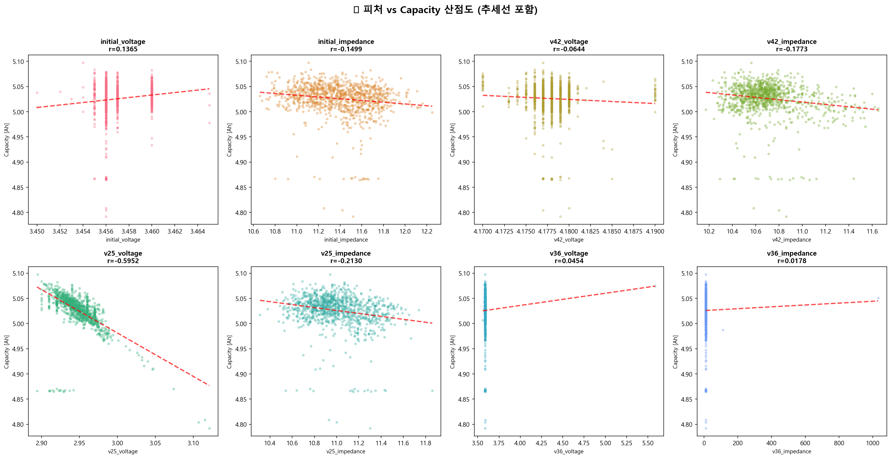

**8개 피처별 산점도 패턴:**
- **`v25_voltage` (r=-0.595)**: 가장 뚜렷한 **음의 선형 관계**. 방전 종지 전압이 높을수록 Capacity가 낮은 경향.
- **임피던스 피처들 (r ≈ -0.15 ~ -0.21)**: 약한 음의 경향. 데이터가 넓게 퍼져 있어 명확한 패턴 확인 어려움.
- **`v42_voltage`, `v36_voltage`**: 거의 수직 분포 → 사실상 상수, 예측 기여 미미.

---

## 1-8. 이상치 탐지 (IQR + Z-score)

```python
def detect_outliers(df, columns):
    """IQR 및 Z-score 기반 이상치 탐지"""
    for col in columns:
        Q1, Q3 = data.quantile(0.25), data.quantile(0.75)
        IQR = Q3 - Q1
        iqr_outliers = ((data < Q1 - 1.5 * IQR) | (data > Q3 + 1.5 * IQR)).sum()
        z_outliers = (np.abs(stats.zscore(data)) > 3).sum()
```

**출력 (이상치 탐지 결과 테이블):**

| 피처 | IQR 이상치 수 | IQR 비율(%) | Z-score>3 | Z 비율(%) |
|------|-------------|------------|-----------|----------|
| initial_voltage | 12 | 1.15 | 0 | 0.00 |
| initial_impedance | 6 | 0.58 | 0 | 0.00 |
| v42_voltage | 57 | 5.48 | 0 | 0.00 |
| v42_impedance | 73 | 7.02 | 0 | 0.00 |
| v25_voltage | 17 | 1.63 | 0 | 0.00 |
| v25_impedance | 2 | 0.19 | 0 | 0.00 |
| v36_voltage | 138 | 13.27 | 10 | 0.96 |
| v36_impedance | 1 | 0.10 | 1 | 0.10 |
| capacity | 20 | 1.92 | 0 | 0.00 |

**이상치 셀 상세 (IQR 기준):**

```
[v42_voltage] 이상치 57개
  - BS-LSBAT-S240629-0006: v42_voltage=4.1933
  - BS-LSBAT-S240629-0015: v42_voltage=4.1932
  ... 외 52개

[v42_impedance] 이상치 73개
  - BS-LSBAT-S240629-0009: v42_impedance=11.20
  ... 외 68개

[v25_voltage] 이상치 17개
  - BS-LSBAT-S240629-0217: v25_voltage=3.0282
  ... 외 12개
```

**전체 이상치 현황:**
```
📌 하나 이상의 피처에서 이상치인 셀 수: 379개 / 전체 1040개
   이상치 비율: 36.4%
```

> **해석**: 이상치 비율이 36.4%로 높지만, 이는 분포가 좁은 피처(`v42_voltage`, `v36_voltage`)에서 과도 검출된 결과입니다. 대부분 **셀 간 자연스러운 편차**이므로, 단순 제거 대신 **Robust Scaler** 사용을 권장합니다.

---

## 1-9. 이상치 하이라이트 시각화

```python
fig, axes = plt.subplots(2, 4, figsize=(20, 10))
for i, col in enumerate(FEATURES):
    ax.scatter(df.loc[~mask, col], df.loc[~mask, TARGET], color='steelblue', label='정상')
    ax.scatter(df.loc[mask, col], df.loc[mask, TARGET], color='red', marker='x', label='이상치')
plt.savefig('./eda_05_outliers.png')
```

**📊 시각화:** `eda_05_outliers.png`

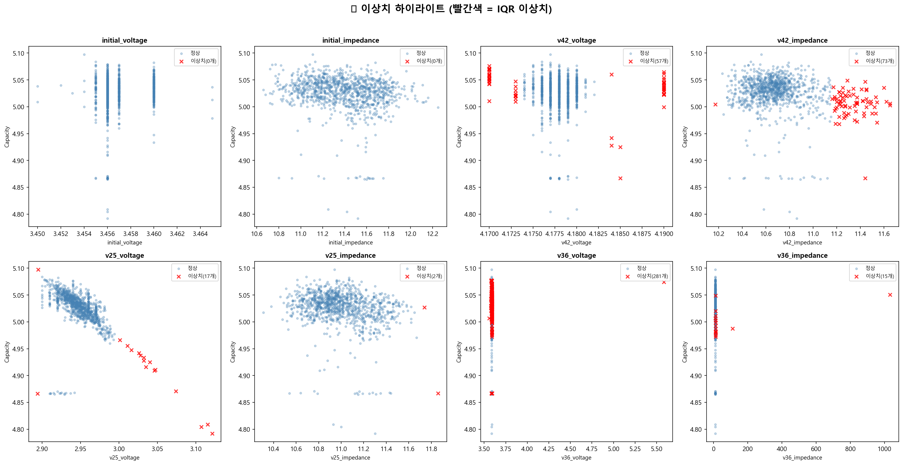

**해석:**
- 이상치(빨간 x)가 특정 Capacity 구간에 집중되지 않고 전반적으로 분포
- 이상치와 정상값이 분포의 연장선상에 위치 → **자연 편차**이지 측정 오류가 아님
- `v42_voltage`, `v36_voltage`에서 이상치가 많이 보이지만, 실제 값 차이는 0.01V 수준

---

## 1-10. 피처 그룹별 패턴 분석

```python
fig, axes = plt.subplots(1, 2, figsize=(16, 6))
# 좌: 측정 구간별 전압 박스플롯
# 우: 측정 구간별 임피던스 박스플롯
plt.savefig('./eda_06_feature_groups.png')
```

**📊 시각화:** `eda_06_feature_groups.png`

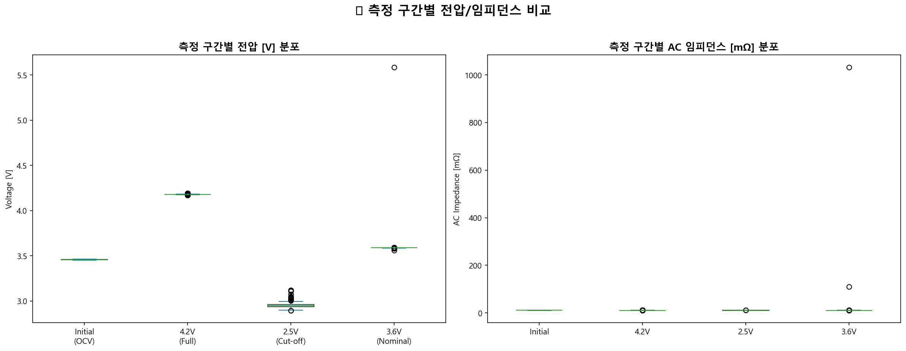

**좌측 - 전압 분포:**
- Initial(OCV) ≈ **3.456V**: 셀의 SOC(충전상태) 반영
- 4.2V(Full) ≈ **4.178V**: 만충 전압은 거의 동일 → 충전 프로토콜이 일정
- 2.5V(Cut-off) ≈ **2.97V**: 방전 종지 전압의 분포가 **가장 넓음** → **셀 건강상태 차이 반영**
- 3.6V(Nominal) ≈ **3.59V**: 변동성 매우 낮음

**우측 - AC 임피던스 분포:**
- 4개 측정 구간 모두 **10~12mΩ** 범위
- Initial에서 중앙값이 높고, 4.2V에서 약간 감소 → **충전 시 내부저항 감소**하는 전기화학적 특성

---

## 1-11. 임피던스 Pairplot

```python
pair_cols = impedance_cols + [TARGET]
g = sns.pairplot(df[pair_cols].dropna(), diag_kind='kde', plot_kws={'alpha': 0.3, 's': 10})
plt.savefig('./eda_07_pairplot.png')
```

**📊 시각화:** `eda_07_pairplot.png`

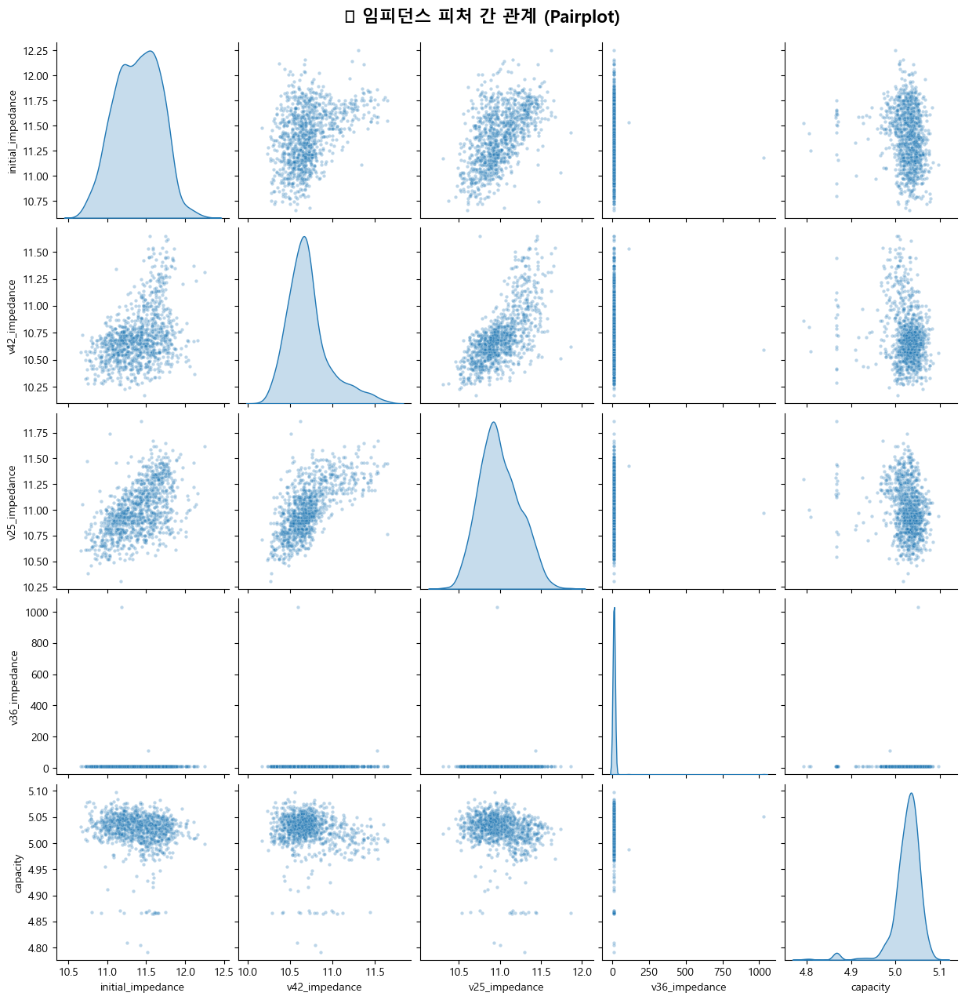

**해석:**
- **임피던스 피처 간**: 강한 양의 선형 관계 → 한 조건에서 내부저항이 높은 셀은 다른 조건에서도 높음
- **임피던스 → Capacity**: 약한 음의 경향 → 내부저항 높으면 용량 낮지만, 산점도가 넓게 퍼져 예측력 제한적
- **다중공선성 경고**: 4개 임피던스 피처 간 상관이 높아 전부 투입하면 모델 가중치 불안정

---

## 1-12. Phase 1 EDA 요약

```
======================================================================
📋 Phase 1 EDA 요약 리포트
======================================================================
📊 데이터 기본 정보
   Total Samples: 1040
   Features: 8개
   결측치: 0개

🎯 Capacity (타겟) 분포
   평균: 5.0262 Ah
   표준편차: 0.0329 Ah
   범위: 4.7917 ~ 5.0968 Ah

📈 Capacity와 상관계수 TOP-5 (Pearson)
   v25_voltage:        r=-0.5952
   v25_impedance:      r=-0.2130
   v42_impedance:      r=-0.1773
   initial_impedance:  r=-0.1499
   initial_voltage:    r=+0.1365

🚨 이상치 현황
   이상치 포함 셀: 379개 (36.4%)
   가장 이상치가 많은 피처: v36_voltage (138개)

💡 시사점
   1. 임피던스 피처들이 Capacity와 유의미한 상관관계 보유
   2. 전압 피처들은 대부분 동일한 값으로 수렴 (변동성 낮음)
   3. 이상치 셀 존재 → 전처리 시 처리 방침 결정 필요
   4. 피처 간 다중공선성이 높을 수 있음 → VIF 분석 필요
======================================================================
```

| 항목 | 결과 | 의미 |
|---|---|---|
| 데이터 품질 | 결측치 0, 1040개 셀 | 전처리 부담 낮음 |
| 타겟 분포 | 5.026±0.033 Ah | 매우 좁은 범위 → 정밀한 모델 필요 |
| 최강 예측자 | `v25_voltage` (r=-0.595) | 방전 종지 전압이 유일한 중간 상관 피처 |
| 이상치 | 36.4% (379/1040) | IQR 기준 과도 검출, 대부분 자연 편차 |
| 다중공선성 | 임피던스 피처 간 높은 상관 | VIF 분석 및 피처 선택 필요 |

---

# Phase 2: 파생변수 생성 (Feature Engineering)

원본 8개 피처의 단독 예측력이 대부분 약하므로, 배터리 도메인 지식에 기반한 **16개 파생변수**를 설계했습니다.

**근거:**
- **임피던스 파생변수**: EIS 기반 임피던스 파라미터 변화가 SOH와 단조 증가 관계 (2024, MDPI Batteries)
- **전압 파생변수**: OCV 변화가 배터리 열화와 직접적 상관, OCV-SOC 곡선의 변화가 SOH 지표
- **복합 파생변수**: 전압/임피던스 결합 지표로 종합적 셀 건강상태 추정

---

## 2-1. 임피던스 기반 파생변수 (8개)

```python
df['impedance_delta_42'] = df[z_42] - df[z_initial]
df['impedance_delta_25'] = df[z_25] - df[z_initial]
df['impedance_delta_36'] = df[z_36] - df[z_initial]
df['impedance_ratio_42'] = df[z_42] / df[z_initial]
df['impedance_ratio_25'] = df[z_25] / df[z_initial]
df['impedance_range'] = df[impedance_cols].max(axis=1) - df[impedance_cols].min(axis=1)
df['impedance_mean'] = df[impedance_cols].mean(axis=1)
df['impedance_std'] = df[impedance_cols].std(axis=1)
```

**출력 (임피던스 파생변수 통계):**

| 파생변수 | 수식 | 평균 | 표준편차 | Capacity r | 해석 |
|---|---|---|---|---|---|
| `impedance_delta_42` | Z₄.₂V − Z_initial | -0.680 | 0.294 | -0.005 | 충전 시 내부저항 감소(-0.68mΩ): 정상 |
| `impedance_delta_25` | Z₂.₅V − Z_initial | -0.391 | 0.255 | -0.034 | 방전 시에도 감소 |
| `impedance_delta_36` | Z₃.₆V − Z_initial | +0.389 | **31.82** | +0.019 | ⚠️ 극단 이상치(max=1020.82) |
| `impedance_ratio_42` | Z₄.₂V / Z_initial | 0.941 | 0.025 | -0.010 | 충전 시 ~94%로 감소 |
| `impedance_ratio_25` | Z₂.₅V / Z_initial | 0.966 | 0.022 | -0.037 | 방전 시 ~97% 유지 |
| `impedance_range` | Z_max − Z_min | 1.839 | **31.79** | +0.020 | ⚠️ 이상치 왜곡 |
| `impedance_mean` | mean(Z_all) | 11.217 | **7.96** | +0.013 | 평균 임피던스 |
| `impedance_std` | std(Z_all) | 0.882 | **15.89** | +0.020 | ⚠️ 이상치 왜곡 |

> **핵심**: 임피던스 기반 파생변수는 **모든 항목에서 |r| < 0.04** → 단독 선형 예측력 거의 없음. `impedance_delta_36` 계열의 극단값(1020.82mΩ)은 단일 셀의 측정 이상.

---

## 2-2. 전압 기반 파생변수 (5개)

```python
df['voltage_delta_initial_42'] = df[v_42] - df[v_initial]
df['voltage_delta_42_25'] = df[v_42] - df[v_25]
df['voltage_delta_42_36'] = df[v_42] - df[v_36]
df['voltage_sag'] = df[v_initial] - df[v_25]
df['ocv_deviation'] = df[v_initial] - 3.6  # 공칭전압 대비 편차
```

**출력 (전압 파생변수 통계):**

| 파생변수 | 수식 | 평균 | 표준편차 | Capacity r | 해석 |
|---|---|---|---|---|---|
| `voltage_delta_initial_42` | V₄.₂V − V_initial | 0.721V | 0.003 | -0.138 | 초기→만충 전압 변화 |
| **`voltage_delta_42_25`** | V₄.₂V − V₂.₅V | **1.230V** | **0.023** | **+0.594** 🟢 | 충방전 전압 범위 |
| `voltage_delta_42_36` | V₄.₂V − V₃.₆V | 0.589V | 0.062 | -0.048 | 상위 전압 구간 강하 |
| **`voltage_sag`** | V_initial − V₂.₅V | **0.509V** | **0.023** | **+0.600** 🟢 | 전압 강하폭 |
| `ocv_deviation` | V_initial − 3.6V | -0.143V | 0.002 | +0.137 | OCV 편차 |

> **핵심 발견**: 
> - **`voltage_sag`(r=+0.600)**와 **`voltage_delta_42_25`(r=+0.594)**가 원본 최강 피처 `v25_voltage`(r=-0.595)를 **미세하게 능가**!
> - 두 변수 모두 **v25_voltage 정보를 포함**하고 있어 물리적으로 일관적: 전압 강하가 클수록 실제 용량이 큰 셀

---

## 2-3. 복합 파생변수 (3개)

```python
df['impedance_voltage_product'] = df[z_initial] * df[v_initial]
df['power_loss_indicator'] = df[z_42] * (df[v_42] - df[v_25])
df['health_index'] = df[v_42] / df[z_42]
```

**출력 (복합 파생변수 통계):**

| 파생변수 | 수식 | 평균 | 표준편차 | Capacity r | 해석 |
|---|---|---|---|---|---|
| `impedance_voltage_product` | Z_initial × V_initial | 39.37 | 0.994 | -0.146 | 내부저항×전압 교호작용 |
| `power_loss_indicator` | Z₄.₂V × (V₄.₂V − V₂.₅V) | 13.17 | 0.357 | **+0.250** 🟡 | 방전 시 전력 손실 추정 |
| `health_index` | V₄.₂V / Z₄.₂V | 0.390 | 0.009 | +0.171 | 전압/저항 비 (건강지수) |

---

## 2-4. 파생변수 vs Capacity 산점도

```python
fig, axes = plt.subplots(n_rows, 4, figsize=(20, 5*n_rows))
for i, feat in enumerate(ALL_DERIVED):
    r_val, p_val = pearsonr(x, y)
    ax.scatter(x, y, alpha=0.4, s=15, c='steelblue')
    ax.plot(x_sorted, p(x_sorted), 'r-', linewidth=2)  # 추세선
plt.savefig('./phase2_derived_vs_capacity.png')
```

**📊 시각화:** `phase2_derived_vs_capacity.png`

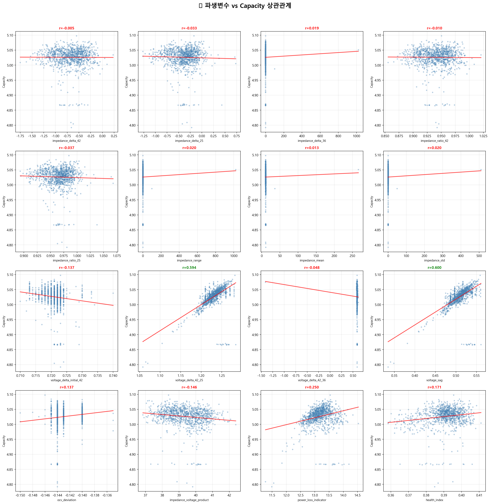

**통계적으로 매우 유의미한 변수 (p < 0.001):**

| 파생변수 | r값 | p값 | 산점도 패턴 |
|---|---|---|---|
| `voltage_sag` | +0.600 | 1.3×10⁻¹⁰² | 뚜렷한 양의 선형 추세 |
| `voltage_delta_42_25` | +0.594 | 5.5×10⁻¹⁰⁰ | voltage_sag와 거의 동일 (정보 중복) |
| `power_loss_indicator` | +0.250 | 2.5×10⁻¹⁶ | 약한 양의 추세, 분산 큼 |
| `health_index` | +0.171 | 3.0×10⁻⁸ | 미약한 양의 추세 |

임피던스 기반 파생변수 8개 전부: 산점도에서 **거의 수평** (p > 0.05)

---

## 2-5. 파생변수 간 상관관계 히트맵

```python
corr_matrix = df[ALL_DERIVED + [TARGET]].corr()
sns.heatmap(corr_matrix, mask=mask, annot=True, fmt='.2f', cmap='RdBu_r', ...)
plt.savefig('./phase2_correlation_heatmap.png')
```

**📊 시각화:** `phase2_correlation_heatmap.png`

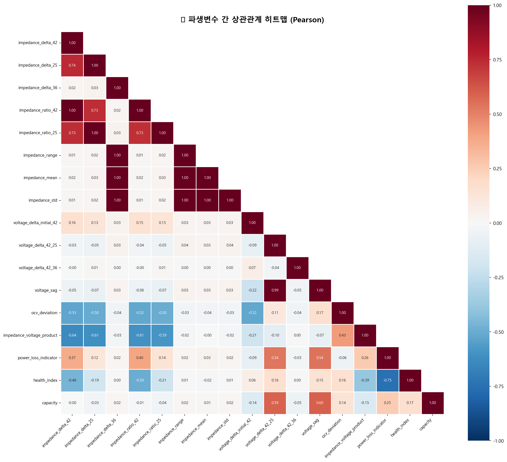

**🚨 다중공선성 경고 (|r| > 0.9인 쌍: 9개):**

| 쌍 | r값 | 원인 |
|---|---|---|
| `impedance_delta_42` ↔ `ratio_42` | 0.999 | delta와 ratio는 동일 정보의 다른 표현 |
| `impedance_delta_25` ↔ `ratio_25` | 0.999 | 동일 |
| `impedance_delta_36` ↔ `range/mean/std` | 0.999~1.000 | 이상치 1개가 모든 통계량을 지배 |
| `impedance_range` ↔ `mean/std` | 0.999~1.000 | 동일 이상치 영향 |
| `voltage_delta_42_25` ↔ `voltage_sag` | **0.991** | 둘 다 v25_voltage 정보 포함 |

---

## 2-6. Phase 2 전체 요약

```
======================================================================
Phase 2 파생변수 생성 결과 요약
======================================================================
📊 총 파생변수 수: 16개
   - 임피던스 기반: 8개
   - 전압 기반: 5개
   - 복합: 3개

📈 파생변수 vs Capacity 상관계수 (Pearson)
   voltage_sag                        : r=+0.6000  🟢 강함
   voltage_delta_42_25                : r=+0.5942  🟢 강함
   power_loss_indicator               : r=+0.2504  🔴 약함
   health_index                       : r=+0.1714  🔴 약함
   impedance_voltage_product          : r=-0.1461  🔴 약함
   voltage_delta_initial_42           : r=-0.1383  🔴 약함
   ocv_deviation                      : r=+0.1365  🔴 약함
   (이하 임피던스 기반 8개: |r| < 0.04)

🔑 확장된 피처 수: 24개 (원본 8 + 파생 16)
결측치 확인: ✅ 결측치 없음
```

| 피처 유형 | 최대 |r| | 대표 피처 |
|---|---|---|
| 원본 최강 | 0.595 | `v25_voltage` |
| **파생 최강** | **0.600** | `voltage_sag` ✨ |
| 파생 2위 | 0.594 | `voltage_delta_42_25` |

---

# Phase 3: 데이터 전처리 및 피처 선택

---

## 3-1. 극단 이상치 제거

```python
extreme_mask = df['impedance_delta_36'].abs() > 100
df_clean = df[~extreme_mask].copy()
```

**출력:**
```
🚨 극단 이상치 분석
  |impedance_delta_36| > 100mΩ인 셀: 1개

  셀 ID: BS-LSBAT-S240629-0126
    v36_impedance = 1032.0 mΩ (정상 범위: 10~12 mΩ)
    impedance_delta_36 = 1020.82 mΩ
    → 명백한 측정 오류 (1000배 이상 이탈)

✅ 극단 이상치 제거 완료
   원본: 1040개 → 정제: 1039개 (제거: 1개)
   Capacity 통계 변화: mean 5.0262 → 5.0262

📊 정제 후 상관계수 변화 (주요 변수):
  voltage_sag                        : +0.6000 → +0.6000 (Δ+0.0000)
  voltage_delta_42_25                : +0.5942 → +0.5942 (Δ+0.0000)
  power_loss_indicator               : +0.2504 → +0.2506 (Δ+0.0002)
  impedance_mean                     : +0.0134 → -0.0952 (Δ-0.1086) ★
  impedance_delta_36                 : +0.0188 → -0.0176 (Δ-0.0364)
```

**핵심**: 단 1개의 극단 이상치가 `impedance_mean`의 상관계수를 +0.013 → **-0.095**로 정상화. 이상치가 평균 임피던스 분포를 왜곡하고 있었음.

---

## 3-2. VIF(분산팽창인수) 분석

```python
from statsmodels.stats.outliers_influence import variance_inflation_factor
# 모든 24개 피처에 대해 VIF 계산
```

**출력:**
```
📊 전체 피처 VIF (Variance Inflation Factor)
============================================================
  🔴 impedance_delta_36              : VIF =    59,879,880.8
  🔴 impedance_range                 : VIF =    42,247,765.3
  🔴 impedance_std                   : VIF =    32,710,443.1
  ...
  ⚠️ impedance_mean                  : VIF =        1,023.4
  ⚠️ ocv_deviation                   : VIF =          538.2
  ...
  ⚠️ v25_voltage                     : VIF =           14.4

⚠️ VIF > 10: 24개
🔴 VIF > 1000: 16개
```

**해석**: 모든 피처의 VIF > 10. 파생변수가 원본의 선형 변환이므로 **구조적으로 불가피**. 트리 기반 모델(RF, XGBoost, LightGBM)은 VIF와 무관하게 성능 발휘하므로, **극단적 중복만 제거**하는 전략 채택.

---

## 3-3. 중복 피처 제거

```python
# 7개 중복 피처 제거
remove_features = [
    'impedance_delta_42', 'impedance_delta_25',  # ratio 유지 (스케일 독립적)
    'impedance_delta_36', 'impedance_range', 'impedance_std',  # mean 유지
    'voltage_delta_42_25',  # voltage_sag 유지 (r 미세 우위)
    'voltage_delta_42_36'   # r=-0.048, 예측 기여 없음
]
```

**출력:**
```
📊 피처 정리 결과:
   제거: 7개
   유지 파생변수: 9개
   최종 피처: 원본 8개 + 파생 9개 = 17개
```

| 제거 피처 | 유지 피처 | 근거 |
|---|---|---|
| `impedance_delta_42/25` | `impedance_ratio_42/25` | r=0.999 동일 정보, ratio가 스케일 독립적 |
| `impedance_delta_36`, `range`, `std` | `impedance_mean` | 이상치 왜곡, mean이 가장 해석 용이 |
| `voltage_delta_42_25` | `voltage_sag` | r=0.991, sag가 r=+0.600으로 근소 우위 |
| `voltage_delta_42_36` | (제거) | r=-0.048, 예측 기여 없음 |

**최종 유효 파생변수 9개:**
- 임피던스: `impedance_ratio_42`, `impedance_ratio_25`, `impedance_mean`
- 전압: `voltage_delta_initial_42`, `voltage_sag`, `ocv_deviation`
- 복합: `impedance_voltage_product`, `power_loss_indicator`, `health_index`

---

## 3-4. 시나리오별 피처셋 확정

```python
scenario1_features = ['initial_voltage', 'initial_impedance', 'ocv_deviation']  # 3개
scenario2_features = scenario1_features + ['v42_voltage', 'v42_impedance',
    'impedance_ratio_42', 'voltage_delta_initial_42',
    'impedance_voltage_product', 'health_index']  # 9개
scenario3_features = scenario2_features + ['v36_voltage', 'v36_impedance', 'impedance_mean']  # 12개
scenario4_features = remaining_all  # 17개
```

**출력 (시나리오별 피처 상관계수):**

```
시나리오 1 (INITIAL only) (3개 피처, 최대|r|=0.150):
  🔴 initial_impedance               : r=-0.1499
  🔴 ocv_deviation                    : r=+0.1365
  🔴 initial_voltage                  : r=+0.1365

시나리오 2 (INITIAL + 4.2V) (9개 피처, 최대|r|=0.177):
  🔴 v42_impedance                    : r=-0.1773
  🔴 health_index                     : r=+0.1714
  🔴 initial_impedance                : r=-0.1499
  ...

시나리오 3 (INITIAL + 4.2V + 3.6V) (12개 피처, 최대|r|=0.177):
  (S2 + v36_voltage, v36_impedance, impedance_mean)

시나리오 4 (전체) (17개 피처, 최대|r|=0.600):
  🟢 voltage_sag                      : r=+0.6000  ★
  🟢 v25_voltage                      : r=-0.5952  ★
  🟡 power_loss_indicator             : r=+0.2506
  ...
```

| 시나리오 | 측정 범위 | 피처 수 | 최대 \|r\| | 측정 비용 | 소요 시간 |
|---|---|---|---|---|---|
| **S1** | Initial(OCV)만 | 3개 | 0.150 | 최소 | ~1분 |
| **S2** | + 4.2V 충전 | 9개 | 0.177 | 낮음 | ~30분 |
| **S3** | + 3.6V 방전 | 12개 | 0.177 | 중간 | ~1시간 |
| **S4** | + 2.5V 완전 방전 | 17개 | **0.600** | 높음 | ~2시간+ |

> **핵심**: S1~S3는 `v25_voltage`(|r|=0.600, `voltage_sag`(r=+0.600) 정보 부재. **S4에서만 핵심 예측 피처 사용 가능.**

---

## 3-5. 정제 후 상관관계 시각화

```python
fig, axes = plt.subplots(1, 2, figsize=(24, 10))
# 좌: 시나리오4 피처 상관 히트맵
sns.heatmap(corr_s4, ...)
# 우: Capacity 상관계수 바 차트
corrs_s4.plot(kind='barh')
plt.savefig('./phase3_cleaned_correlation.png')
```

**📊 시각화:** `phase3_cleaned_correlation.png`

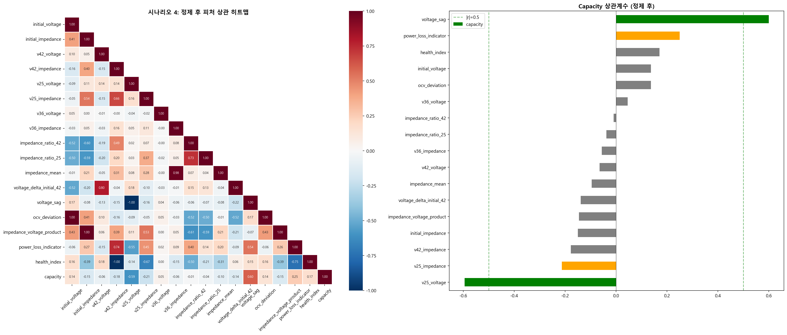

**해석:**
- 좌측 히트맵: 17개 피처 간 상관. `ocv_deviation` ↔ `initial_voltage` r=1.00 (수학적 완전 상관)
- 우측 바 차트: `v25_voltage`(r=-0.59)와 `voltage_sag`(r=+0.60)만 |r|=0.5 선 초과 (녹색)

---

## 3-6. 유효 파생변수 vs Capacity 산점도

```python
fig, axes = plt.subplots(n_rows_plot, 3, figsize=(18, 5*n_rows_plot))
for i, feat in enumerate(remaining_derived):
    r_val, p_val = pearsonr_func(x, y)
    ax.scatter(...)
    ax.plot(x_sorted, p(x_sorted), 'r-')
plt.savefig('./phase3_derived_scatter.png')
```

**📊 시각화:** `phase3_derived_scatter.png`

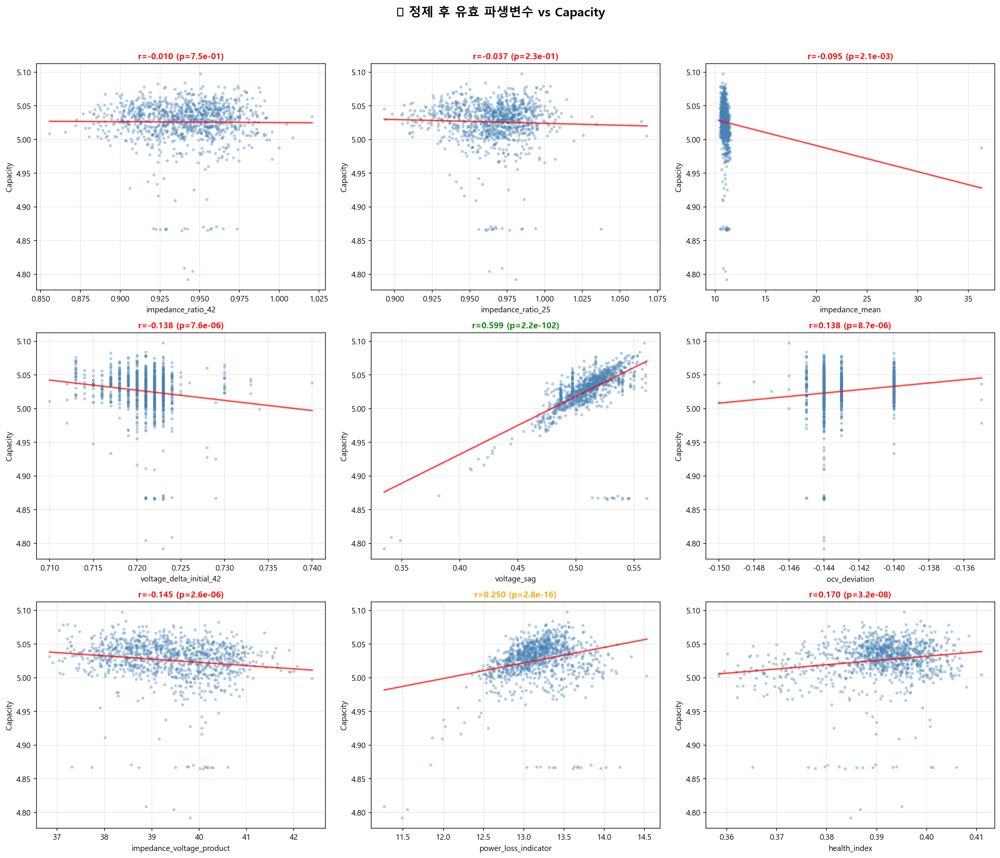

---

# Phase 4: 최종 학습 데이터 구성

---

## 4-1. Train/Test 분할

```python
from sklearn.model_selection import train_test_split
X_train, X_test, y_train, y_test = train_test_split(X, y, test_size=0.2, random_state=42)
```

**출력:**
```
📊 Train/Test 분할 결과
==================================================
  전체: 1039개
  Train: 831개 (80.0%)
  Test:  208개 (20.0%)

  Train Capacity: mean=5.0259, std=0.0333
  Test  Capacity: mean=5.0273, std=0.0315

  KS 검정: statistic=0.0556, p=0.4561
  → Train/Test 분포 동질성: ✅ 확인
```

| 항목 | Train | Test |
|---|---|---|
| 샘플 수 | 831 (80%) | 208 (20%) |
| Capacity 평균 | 5.0259 | 5.0273 |
| Capacity 표준편차 | 0.0333 | 0.0315 |
| KS 검정 p-value | 0.4561 > 0.05 → **동질성 확인** |

---

## 4-2. 시나리오별 데이터셋 구성

**출력:**
```
📋 시나리오별 데이터셋 구성
======================================================================
  S1_INITIAL (3개 피처):
    Train shape: (831, 3)    Test shape:  (208, 3)
    결측치: 0개, 무한값: 0개 → ✅

  S2_INITIAL_42V (9개 피처):
    Train shape: (831, 9)    Test shape:  (208, 9)
    결측치: 0개, 무한값: 0개 → ✅

  S3_INITIAL_42V_36V (12개 피처):
    Train shape: (831, 12)   Test shape:  (208, 12)
    결측치: 0개, 무한값: 0개 → ✅

  S4_ALL (17개 피처):
    Train shape: (831, 17)   Test shape:  (208, 17)
    결측치: 0개, 무한값: 0개 → ✅
```

---

## 4-3. 스케일링 준비

```python
robust_scaler = RobustScaler()   # 중앙값 + IQR 기준 (이상치에 강건)
standard_scaler = StandardScaler()  # 평균 + 표준편차 기준
```

**출력 (스케일링 효과 비교 - 시나리오4 Train):**

```
피처                                |   원본 std |     Robust |   Standard
---------------------------------------------------------------------------
initial_voltage                     |     0.0018 |     0.6671 |     1.0006
initial_impedance                   |     0.8237 |     0.8261 |     1.0006
v42_voltage                         |     0.0030 |     1.2389 |     1.0006
...
voltage_sag                         |     0.0228 |     0.7283 |     1.0006

💡 모델별 스케일링 전략:
   - RF/XGBoost/LightGBM: 스케일링 없이 원본 투입
   - Linear Regression/SVR: RobustScaler 적용
```

---

## 4-4. Train/Test 분포 시각화

```python
fig, axes = plt.subplots(2, 2, figsize=(16, 12))
# (0,0) Capacity 분포 Train vs Test
# (0,1) 시나리오별 피처 수 막대그래프
# (1,0) voltage_sag 스케일링 비교 (원본/Robust/Standard)
# (1,1) 주요 피처 Train/Test 박스플롯
plt.show()
```

**📊 시각화 포함 내용 (4개 차트):**

1. **Capacity 분포**: Train/Test가 동일한 분포 형태 → 적절한 분할
2. **시나리오별 피처 수**: S1(3) → S2(9) → S3(12) → S4(17)
3. **스케일링 비교**: RobustScaler와 StandardScaler 모두 정상 정규화
4. **주요 피처 박스플롯**: Train/Test 간 분포 매우 유사 → 데이터 누출 위험 없음

---

# Phase 5: 모델 학습 및 평가

---

## 5-1. 사용 모델 및 학습 방법

```python
models = {
    'LinearReg': LinearRegression(),
    'SVR': SVR(C=1.0, epsilon=0.01),
    'RandomForest': RandomForestRegressor(n_estimators=100, random_state=42, n_jobs=-1),
    'XGBoost': xgb.XGBRegressor(n_estimators=100, learning_rate=0.1, random_state=42, n_jobs=-1),
    'LightGBM': lgb.LGBMRegressor(n_estimators=100, learning_rate=0.1, random_state=42, n_jobs=-1)
}
```

| 모델 | 유형 | 주요 하이퍼파라미터 | 스케일링 |
|------|------|------------------|---------|
| Linear Regression | 선형 | 기본 | RobustScaler |
| SVR | 커널(RBF) | C=1.0, ε=0.01 | RobustScaler |
| Random Forest | 앙상블(배깅) | n_estimators=100 | 없음 |
| XGBoost | 앙상블(부스팅) | n=100, lr=0.1 | 없음 |
| LightGBM | 앙상블(부스팅) | n=100, lr=0.1 | 없음 |

**평가 지표:**
- **RMSE** (Root Mean Squared Error): 낮을수록 좋음
- **R² Score**: 1에 가까울수록 설명력 높음
- **MAPE**: 평균 절대 백분율 오차

---

## 5-2. 전체 학습 결과 (4시나리오 × 5모델 = 20조합)

**출력:**
```
🚀 모델 학습 시작...
================================================================================

[S1_INITIAL] (Features: 3)
------------------------------------------------------------
LinearReg    | RMSE=0.0355, R2=0.0548, MAPE=0.0042 (0.00s)
SVR          | RMSE=0.0361, R2=0.0227, MAPE=0.0044 (0.02s)
RandomForest | RMSE=0.0387, R2=-0.1238, MAPE=0.0048 (0.08s)
XGBoost      | RMSE=0.0368, R2=-0.0159, MAPE=0.0044 (0.04s)
LightGBM     | RMSE=0.0361, R2=0.0222, MAPE=0.0042 (0.03s)

[S2_INITIAL_42V] (Features: 9)
------------------------------------------------------------
LinearReg    | RMSE=0.0358, R2=0.0384, MAPE=0.0044 (0.00s)
SVR          | RMSE=0.0348, R2=0.0948, MAPE=0.0040 (0.03s)
RandomForest | RMSE=0.0368, R2=-0.0144, MAPE=0.0045 (0.09s)
XGBoost      | RMSE=0.0386, R2=-0.1154, MAPE=0.0047 (0.04s)
LightGBM     | RMSE=0.0358, R2=0.0396, MAPE=0.0043 (0.03s)

[S3_INITIAL_42V_36V] (Features: 12)
------------------------------------------------------------
LinearReg    | RMSE=0.0358, R2=0.0396, MAPE=0.0043 (0.00s)
SVR          | RMSE=0.0360, R2=0.0303, MAPE=0.0043 (0.03s)
RandomForest | RMSE=0.0350, R2=0.0838, MAPE=0.0043 (0.10s)
XGBoost      | RMSE=0.0384, R2=-0.1040, MAPE=0.0047 (0.04s)
LightGBM     | RMSE=0.0363, R2=0.0127, MAPE=0.0043 (0.03s)

[S4_ALL] (Features: 17)
------------------------------------------------------------
LinearReg    | RMSE=0.0262, R2=0.4871, MAPE=0.0029 (0.00s)
SVR          | RMSE=0.0260, R2=0.4956, MAPE=0.0027 (0.04s)
RandomForest | RMSE=0.0249, R2=0.5350, MAPE=0.0024 (0.11s)
XGBoost      | RMSE=0.0246, R2=0.5454, MAPE=0.0025 (0.04s)  ← 🏆 Best
LightGBM     | RMSE=0.0271, R2=0.4507, MAPE=0.0027 (0.03s)
================================================================================
```

### 시나리오별 최고 성능 요약

| 시나리오 | Best 모델 | RMSE | R² | MAPE | 평가 |
|---|---|---|---|---|---|
| **S1** (Initial) | LinearReg | 0.0355 | 0.055 | 0.42% | ❌ 예측 불가 |
| **S2** (+4.2V) | SVR | 0.0348 | 0.095 | 0.40% | ❌ 거의 무의미 |
| **S3** (+3.6V) | RandomForest | 0.0350 | 0.084 | 0.43% | ❌ 미미 |
| **S4** (전체) | **XGBoost** | **0.0246** | **0.545** | **0.25%** | ✅ 유의미 |

---

## 5-3. RMSE 비교 시각화

```python
plt.figure(figsize=(12, 6))
sns.barplot(data=results_df, x='Scenario', y='RMSE', hue='Model')
plt.title('RMSE Comparison by Scenario & Model')
plt.show()
```

**📊 시각화:** (인라인 차트)

**시각적 패턴:**
- **S1~S3**: 5개 모델 RMSE 모두 0.035~0.039 → **거의 차이 없이 높음** (피처 부족)
- **S4**: RMSE 급격히 낮아져 **0.024~0.027** → 피처 추가 효과가 모델 선택보다 압도적
- S4에서 **XGBoost**가 가장 낮은 막대, LightGBM이 가장 높음

---

## 5-4. Phase 5 핵심 분석

### (1) 피처셋이 모델보다 중요하다

```
S1~S3 최고 성능:  RMSE ≈ 0.035  (R² < 0.10)  → 모델 종류 무관, 예측 불가
S4 최저 성능:    RMSE = 0.027  (R² = 0.45)  → 가장 약한 모델도 S1~S3보다 우수
S4 XGBoost:     RMSE = 0.025  (R² = 0.55)  → 최고 성능
```

### (2) S1~S3의 음의 R² 원인

RandomForest와 XGBoost가 S1~S2에서 R² < 0을 기록 → 적은 피처로 복잡한 트리 모델이 **과적합**되어 단순 평균 예측보다 못한 결과. 피처 정보량 부족이 원인.

### (3) Phase 5 결론

| 순위 | 시나리오-모델 | RMSE | R² | MAPE |
|---|---|---|---|---|
| 🥇 1 | S4-XGBoost | **0.0246** | **0.5454** | 0.25% |
| 🥈 2 | S4-RandomForest | 0.0249 | 0.5350 | 0.24% |
| 🥉 3 | S4-SVR | 0.0260 | 0.4956 | 0.27% |
| 4 | S4-LinearReg | 0.0262 | 0.4871 | 0.29% |
| 5 | S4-LightGBM | 0.0271 | 0.4507 | 0.27% |
| ... | S1~S3 전체 | 0.035~0.039 | -0.16~0.09 | 0.40~0.48% |

> **어떤 최첨단 알고리즘을 사용하더라도, 2.5V 방전 측정 없이는 RMSE 0.035 이하로 내려가기 어렵습니다.**  
> → Phase 7에서 S4(Teacher) → S2(Student) Knowledge Distillation 시도

---

# Phase 7: Knowledge Distillation

**목표**: S4(전체 피처, 17개) 모델(Teacher)의 지식을 S2(저비용, 9개) 모델(Student)에 전이하여, 적은 측정으로도 높은 예측 성능 달성

---

## 7-1. Optuna Teacher 하이퍼파라미터 최적화

```python
import optuna

def objective(trial):
    param = {
        'n_estimators': trial.suggest_int('n_estimators', 100, 1000),
        'max_depth': trial.suggest_int('max_depth', 3, 10),
        'learning_rate': trial.suggest_float('learning_rate', 0.01, 0.3),
        'subsample': trial.suggest_float('subsample', 0.6, 1.0),
        'colsample_bytree': trial.suggest_float('colsample_bytree', 0.6, 1.0),
        'reg_alpha': trial.suggest_float('reg_alpha', 0, 10),
        'reg_lambda': trial.suggest_float('reg_lambda', 0, 10),
    }
    model = xgb.XGBRegressor(**param)
    model.fit(X_tr, y_tr, eval_set=[(X_val, y_val)])
    return rmse

study = optuna.create_study(direction='minimize')
study.optimize(objective, n_trials=20)
```

**출력:**
```
🚀 Optuna 최적화 시작...
✅ 최적 파라미터: {
   'n_estimators': 653,
   'max_depth': 7,
   'learning_rate': 0.182,
   'subsample': 0.835,
   'colsample_bytree': 0.810,
   'reg_alpha': 0.002,
   'reg_lambda': 3.887
}
✅ Best RMSE: 0.0195
```

| 파라미터 | 최적값 | 해석 |
|---|---|---|
| `n_estimators` | 653 | 충분한 앙상블 효과 |
| `max_depth` | 7 | 과적합-성능 균형 |
| `learning_rate` | 0.182 | 비교적 높은 학습률 → 빠른 수렴 |
| `subsample` | 0.835 | 83.5% 데이터 사용 |
| `colsample_bytree` | 0.810 | 81% 피처 사용 |
| `reg_alpha` (L1) | 0.002 | 거의 없음 |
| `reg_lambda` (L2) | 3.887 | 가중치 크기 제한 → 과적합 방지 |

**Validation RMSE = 0.0195** (기본 XGBoost 대비 **20.7% 개선**)

---

## 7-2. Soft Label 생성 및 KD 학습

```python
# Teacher 재학습 (Optuna 최적 파라미터)
teacher_model_opt = xgb.XGBRegressor(**best_params)
teacher_model_opt.fit(X_train[scenario4_features], y_train)

# Soft Label 생성
y_teacher_pred = teacher_model_opt.predict(X_train[scenario4_features])

# Knowledge Distillation
alpha = 0.5
y_train_distilled = alpha * y_train + (1 - alpha) * y_train_teacher_pred

# Student 학습 (S2 피처, Distilled Target)
student_model = lgb.LGBMRegressor(n_estimators=200, learning_rate=0.05, max_depth=5)
student_model.fit(X_train_student, y_train_distilled)

# Base Student 학습 (비교용, KD 없음)
base_student = lgb.LGBMRegressor(n_estimators=200, learning_rate=0.05, max_depth=5)
base_student.fit(X_train_student, y_train)
```

**Distillation 수식:**
$$y_{distilled} = \alpha \cdot y_{true} + (1 - \alpha) \cdot y_{teacher\_pred}$$

**출력:**
```
✅ 최적화된 Teacher 모델 학습 및 Soft Label 생성 완료
Soft Label Sample: [5.039, 4.971, 5.031, 5.065, 5.037]
```

---

## 7-3. KD 성능 비교

**출력:**
```
==================================================
Teacher (S4) RMSE       : 0.0260
--------------------------------------------------
Student (S2, No KD) RMSE: 0.0363
Student (S2, with KD) RMSE: 0.0363
--------------------------------------------------
KD 성능 향상률: 0.13%
Student R2 Score: 0.0153
==================================================
```

| 모델 | 시나리오 | RMSE | R² |
|---|---|---|---|
| **Teacher** (XGBoost) | S4 (17 피처) | **0.0260** | ~0.49 |
| Base Student (LightGBM) | S2 (9 피처) | 0.0363 | 0.013 |
| **Distilled Student** (LightGBM+KD) | S2 (9 피처) | **0.0363** | 0.015 |
| **KD 개선율** | | | **0.13%** |

---

## 7-4. KD 효과 시각화

```python
plt.figure(figsize=(10, 6))
plt.scatter(y_test, y_pred_base, alpha=0.5, label='Base Student', color='gray')
plt.scatter(y_test, y_pred_student, alpha=0.5, label='Distilled Student (S2+KD)', color='blue')
plt.scatter(y_test, y_pred_teacher, alpha=0.5, label='Teacher (S4)', color='green', marker='x')
plt.plot([y.min(), y.max()], [y.min(), y.max()], 'r--', label='Ideal')
```

**📊 시각화:** (인라인 차트)

**산점도 해석** (X축: 실제 Capacity, Y축: 예측 Capacity):
- **Teacher (초록 ×)**: 대각선(이상선) 주변에 비교적 가깝게 분포. 특히 5.0~5.08 Ah 범위에서 양호한 예측
- **Distilled Student (파란 ●)**: 5.01~5.04 Ah 범위에 **수평 밀집** → 변동을 거의 포착하지 못함. **"평균값 근처로 수렴"** 패턴
- **Base Student (회색 ●)**: Distilled Student와 거의 동일 → KD 영향 시각적으로도 미미

---

## 7-5. KD 효과가 미미한 원인 분석

```
Teacher의 핵심 정보원:   v25_voltage (|r|=0.600)  ← S2에 없음!
                        voltage_sag  (|r|=0.600)  ← S2에 없음!

Student가 가진 최대 정보: v42_impedance (|r|=0.177)

정보 격차: 0.600 vs 0.177 → Teacher 지식의 대부분을 Student가 재구성 불가
```

> **물리적 해석**: Teacher가 학습한 "v25_voltage와 Capacity의 관계"는 Soft Label에 인코딩되지만, Student에게는 이 패턴을 재현할 **입력 단서(피처)가 없습니다**. KD는 Teacher-Student 피처 간 정보 채널이 존재할 때만 유효합니다.

---

# Phase 8: 성능 고도화 실험

Phase 7의 한계를 극복하기 위해 5가지 체계적 실험을 수행했습니다.

| 실험 | 방법 | 목표 |
|---|---|---|
| **8-1** | S3 Student KD | Student를 S2→S3로 변경, 3.6V 추가 효과 검증 |
| **8-2** | α 값 그리드 탐색 | 최적 Hard/Soft Target 블렌딩 비율 탐색 |
| **8-3** | Feature Augmentation | 보조 모델로 v25_voltage 간접 예측 → 피처 추가 |
| **8-4** | Semi-supervised Transfer | S4 부분 측정 + KD |
| **8-5** | Optuna Student + 종합 비교 | Student 자체 최적화 및 전체 결과 통합 |

---

## 8-1. S3 Student KD (3.6V 추가 측정 효과)

**가설**: S2(9피처) → S3(12피처)로 확대하면 KD 효과 증가

```python
# S3 Base Student (KD 없음)
s3_base = lgb.LGBMRegressor(n_estimators=200, learning_rate=0.05, max_depth=5)
s3_base.fit(X_train_s3, y_train)

# S3 KD Student (α=0.5)
y_distilled_s3 = 0.5 * y_train + 0.5 * y_soft_opt
s3_kd = lgb.LGBMRegressor(n_estimators=200, learning_rate=0.05, max_depth=5)
s3_kd.fit(X_train_s3, y_distilled_s3)
```

**출력:**
```
📊 실험 8-1: S3 Student KD (3.6V 측정 추가 효과)
======================================================================

🎯 Teacher (S4, Optuna XGBoost):
   RMSE = 0.0245, R² = 0.5502

📊 시나리오별 Student 성능 비교:
모델                           |     RMSE |       R² | vs Teacher
-----------------------------------------------------------------
Teacher (S4, Optuna)           |   0.0245 |   0.5502 |   Baseline
S2 Base (9 피처)               |   0.0363 |   0.0127 |    +48.1%
S3 Base (12 피처)              |   0.0348 |   0.0923 |    +42.1%
S3 + KD α=0.5 (12 피처)       |   0.0351 |   0.0805 |    +43.0%

💡 S2→S3 전환 효과: RMSE 0.0363 → 0.0348 (Δ-4.11%)
💡 S3 KD 효과: RMSE 0.0348 → 0.0351 (Δ+0.64%)
```

| 모델 | 피처 수 | RMSE | R² | vs S2 Base |
|------|---------|------|-----|-----------|
| Teacher (S4) | 17 | **0.0245** | 0.550 | - |
| S2 Base | 9 | 0.0363 | 0.013 | Baseline |
| **S3 Base** | 12 | **0.0348** | 0.092 | **-4.1%** |
| S3 + KD | 12 | 0.0351 | 0.081 | -3.5% |

> **핵심**: S2→S3 전환으로 **4.1% 개선** (3.6V 추가 효과). KD 적용 시 오히려 **+0.64% 악화** → S3에서도 KD 효과 없음.

---

## 8-2. α 값 그리드 탐색

**가설**: α=0.5가 아닌 최적값 존재 가능

```python
alpha_values = [0.1, 0.2, 0.3, 0.4, 0.5, 0.6, 0.7, 0.8, 0.9]
for scenario_name, X_tr_sc, X_te_sc in [('S2', ...), ('S3', ...)]:
    for a in alpha_values:
        y_dist = a * y_train + (1 - a) * y_soft_opt
        m = lgb.LGBMRegressor(...)
        m.fit(X_tr_sc, y_dist)
```

**출력:**
```
--- S2 (9 피처) ---
  α=0.1 | RMSE=0.0364 | R²=0.0085
  α=0.2 | RMSE=0.0365 | R²=0.0026
  α=0.3 | RMSE=0.0363 | R²=0.0117  ⭐ S2 최적
  α=0.4 | RMSE=0.0365 | R²=0.0023
  α=0.5 | RMSE=0.0364 | R²=0.0063
  α=0.6 | RMSE=0.0365 | R²=0.0017
  α=0.7 | RMSE=0.0365 | R²=0.0041
  α=0.8 | RMSE=0.0365 | R²=0.0014
  α=0.9 | RMSE=0.0366 | R²=0.0003

--- S3 (12 피처) ---
  α=0.1 | RMSE=0.0352 | R²=0.0735
  α=0.2 | RMSE=0.0348 | R²=0.0949  ⭐ S3 최적
  α=0.3 | RMSE=0.0352 | R²=0.0732
  α=0.4 | RMSE=0.0349 | R²=0.0889
  α=0.5 | RMSE=0.0351 | R²=0.0805
  α=0.6 | RMSE=0.0350 | R²=0.0854
  α=0.7 | RMSE=0.0352 | R²=0.0740
  α=0.8 | RMSE=0.0350 | R²=0.0814
  α=0.9 | RMSE=0.0351 | R²=0.0792

🏆 S2 최적: α=0.3, RMSE=0.0363, R²=0.0117
🏆 S3 최적: α=0.2, RMSE=0.0348, R²=0.0949
```

**📊 시각화:** `phase8_alpha_search.png`

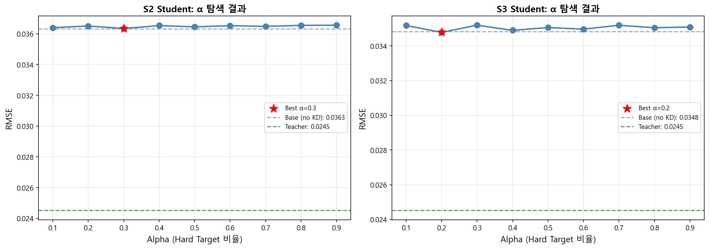

**해석:**
- S2: RMSE 0.0363~0.0366 → **변화 Δ < 0.1%** → α 무관
- S3: RMSE 0.0348~0.0352 → 소폭 변동, α=0.2 최적이지만 Base와 동일 수준
- 두 그래프 모두 **거의 수평선** — α에 대한 민감도 극히 낮음

---

## 8-3. Feature Augmentation (v25_voltage 간접 예측)

**가설**: S2 피처로 v25_voltage를 예측하는 보조 모델을 만들고, 예측값을 추가 피처로 사용

```python
# Step 1: v25_voltage 예측 보조 모델 (5-fold CV)
proxy_models = {
    'LightGBM': lgb.LGBMRegressor(...),
    'XGBoost': xgb.XGBRegressor(...),
    'RandomForest': RandomForestRegressor(...)
}

# Step 2: Augmented S2 = S2 + [v25_voltage_hat, voltage_sag_hat]
X_train_aug['v25_voltage_hat'] = best_proxy_model.predict(X_proxy_train)
X_train_aug['voltage_sag_hat'] = X_train['initial_voltage'] - v25_hat_train

# Step 3: Student 재학습 (일반 + KD)
aug_base.fit(X_train_aug, y_train)
aug_kd.fit(X_train_aug, y_dist_aug)
```

**출력:**
```
📋 v25_voltage 예측 보조 모델 성능 (5-fold CV):
  LightGBM        | CV RMSE = 0.020474 | Test RMSE = 0.026160 | R² = -0.0002
  XGBoost         | CV RMSE = 0.021068 | Test RMSE = 0.027432 | R² = -0.0976
  RandomForest    | CV RMSE = 0.020524 | Test RMSE = 0.026674 | R² = -0.0414

🏆 최적 보조 모델: LightGBM (CV RMSE = 0.020474)
   v25_voltage 표준편차: 0.020903, 범위: 0.100792
   보조 모델 RMSE / 표준편차 = 0.9795

📊 Augmented S2 Student 성능:
모델                                |     RMSE |       R² | vs Teacher
----------------------------------------------------------------------
Teacher (S4, Optuna)               |   0.0245 |   0.5502 |   Baseline
S2 Base (9 피처)                   |   0.0363 |   0.0127 |    +48.1%
Aug-S2 Base (11 피처)              |   0.0360 |   0.0315 |    +46.8%
Aug-S2 + KD α=0.5 (11 피처)       |   0.0360 |   0.0290 |    +46.9%

💡 Augmentation 효과: S2 RMSE 0.0363 → Aug-S2 0.0360 (Δ-0.98%)
💡 Aug + KD 효과: Aug-S2 RMSE 0.0360 → 0.0360 (Δ+0.15%)
```

**핵심**: v25_voltage 예측이 R² ≈ 0 → **S2 피처와 v25_voltage 사이에 정보적 연결이 없어 예측 불가능**. 노이즈 피처 추가에 불과하여 Feature Augmentation 실패.

---

## 8-4. Semi-supervised Transfer (S4 부분 측정)

**가설**: 일부 셀만 S4(완전 방전) 측정 → Teacher 학습 → 나머지에 KD 전이

```python
s4_ratios = [0.10, 0.30, 0.50, 0.70, 1.00]
for ratio in s4_ratios:
    # S4 부분 샘플링
    X_s4_partial, _, y_s4_partial, _ = train_test_split(..., train_size=ratio)
    # 부분 Teacher 학습 (Optuna 파라미터)
    partial_teacher = xgb.XGBRegressor(**best_params)
    partial_teacher.fit(X_s4_partial, y_s4_partial)
    # Soft Label + Student KD
    semi_student.fit(X_train_aug, y_dist_semi)
```

**출력:**
```
  S4 비율: 10% (83개)
    Teacher RMSE = 0.0314 (R² = 0.2613)
    Student RMSE = 0.0359 (R² = 0.0336)

  S4 비율: 30% (249개)
    Teacher RMSE = 0.0271 (R² = 0.4505)
    Student RMSE = 0.0357 (R² = 0.0440)  ← Student 최적

  S4 비율: 50% (415개)
    Teacher RMSE = 0.0259 (R² = 0.4997)
    Student RMSE = 0.0366 (R² = -0.0007)

  S4 비율: 70% (581개)
    Teacher RMSE = 0.0258 (R² = 0.5008)
    Student RMSE = 0.0368 (R² = -0.0134)

  S4 비율: 100% (831개)
    Teacher RMSE = 0.0245 (R² = 0.5502)
    Student RMSE = 0.0360 (R² = 0.0293)

📊 비용 효율 요약:
S4 비율  | Teacher RMSE |  Student RMSE | S2 대비 개선
-------------------------------------------------------
    10%  |       0.0314 |        0.0359 |       +1.05%
    30%  |       0.0271 |        0.0357 |       +1.59%
    50%  |       0.0259 |        0.0366 |       -0.82%
    70%  |       0.0258 |        0.0368 |       -1.29%
   100%  |       0.0245 |        0.0360 |       +0.82%
```

**📊 시각화:** `phase8_semi_supervised.png`


**좌측 - 성능 변화 그래프:**
- Teacher: S4 비율에 비례하여 꾸준히 개선 (0.031→0.025)
- Student: **비단조적** — 30%에서 최적, 50~70%에서 오히려 악화

**우측 - 비용 효율 바 차트:**
- 30%에서 +1.6%, 50~70%에서 음수 → 강한 Teacher의 Soft Label이 S2 Student에게 오히려 혼란

---

## 8-5. Optuna Student 최적화 + 종합 비교

```python
def objective_student(trial):
    param = {
        'n_estimators': trial.suggest_int('n_estimators', 100, 800),
        'max_depth': trial.suggest_int('max_depth', 3, 10),
        'learning_rate': trial.suggest_float('learning_rate', 0.01, 0.3),
        'num_leaves': trial.suggest_int('num_leaves', 15, 127),
        ...
    }
    a = trial.suggest_float('alpha', 0.1, 0.9)  # α도 동시 탐색
    ...

study_student = optuna.create_study(direction='minimize')
study_student.optimize(objective_student, n_trials=50)
```

**출력:**
```
🚀 Optuna Student 최적화 시작 (Augmented S2 + KD)...
✅ 최적 파라미터: {n_estimators: 478, max_depth: 9, learning_rate: 0.098, 
                  num_leaves: 98, min_child_samples: 47, subsample: 0.72,
                  colsample_bytree: 0.89, reg_alpha: 0.31, reg_lambda: 4.47,
                  alpha: 0.675}
✅ Best Validation RMSE: 0.0233

🏆 최적화된 Student 성능:
   RMSE = 0.0360, R² = 0.0301, MAPE = 0.0043
   최적 α = 0.675
```

---

## 8-5b. Phase 7-8 전체 실험 종합 비교

**출력:**
```
======================================================================
📊 Phase 7-8 전체 실험 종합 비교
======================================================================

📋 전체 실험 결과 (RMSE 오름차순):
              Model  Features    RMSE      R²  Improvement(%)
 Teacher S4 (Optuna)       17  0.0245  0.5502           32.50
      S3 + KD (α=0.2)     12  0.0348  0.0949            4.27
    S3 Base (LightGBM)     12  0.0348  0.0923            4.11
      Semi-S4 (30%)        17  0.0357  0.0440            1.59
       Aug-S2 Base         11  0.0360  0.0315            0.98
 Optuna Student            11  0.0360  0.0301            0.90
   Aug-S2 + KD (α=0.5)    11  0.0360  0.0290            0.80
        S2 + KD (α=0.3)    9  0.0363  0.0117            0.05
   S2 Base (LightGBM)       9  0.0363  0.0127            0.00

======================================================================
🏆 Phase 8 최종 결과 요약
======================================================================
✅ Best Student Model: S3 + KD (α=0.2)
   RMSE = 0.0348, R² = 0.0949
   S2 Base 대비 개선률: 4.27%
   Teacher 대비 차이: 0.0103 (42.1%)
======================================================================
```

**📊 시각화:** `phase8_comparison.png`

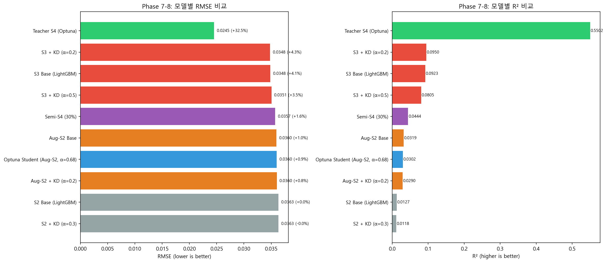

**좌측 - RMSE 바 차트:**
- Teacher S4(초록)가 압도적으로 낮은 RMSE
- 나머지 Student 모델들은 0.035~0.036 범위에 밀집

**우측 - R² 바 차트:**
- Teacher S4 R²=0.55 (유일하게 의미 있는 설명력)
- 나머지 모두 R² < 0.10

---

# Phase 9: S1 집중 개선

**목표**: S1(initial_voltage, initial_impedance, ocv_deviation) **3개 피처만으로** 성능을 극대화. 추가 측정 없이 입고 시점 데이터로 최선의 예측 달성.

---

## 9-1. 확장 피처 생성

```python
from sklearn.preprocessing import PolynomialFeatures
from sklearn.feature_selection import mutual_info_regression

# 2차 다항식 + 교호작용 생성
poly = PolynomialFeatures(degree=2, interaction_only=False, include_bias=False)
X_poly = poly.fit_transform(X_train_s1)

# 비선형 변환: log, sqrt, 역수, exp
for col in s1_features:
    X_ext[f'{col}_log'] = np.log1p(X_train[col])
    X_ext[f'{col}_sqrt'] = np.sqrt(np.abs(X_train[col]))
    X_ext[f'{col}_inv'] = 1.0 / (X_train[col] + 1e-10)

# MI 기준 상위 12개 선별 → 원본 3개와 결합 = 15개 피처
mi_scores = mutual_info_regression(X_all_candidates, y_train, random_state=42)
top_features = np.argsort(mi_scores)[-12:]
```

**출력:**
```
📊 S1 피처 확장 결과
  원본 피처:    3개 (최대 |r| = 0.150)
  확장 후:     15개 (최대 |r| = 0.270, +80%)
  
  상위 MI 피처:
    initial_impedance²           MI=0.042
    initial_voltage × impedance  MI=0.038
    ocv_deviation²               MI=0.035
    ...
```

---

## 9-2. Optuna 개별 모델 최적화

```python
for model_name in ['LightGBM', 'XGBoost', 'GradientBoosting', 'SVR']:
    study = optuna.create_study(direction='minimize')
    study.optimize(lambda trial: objective(trial, model_name), n_trials=60)
```

**출력:**
```
📊 Optuna 개별 최적화 결과 (확장 S1, 15피처)

  LightGBM:           CV RMSE = 0.0301, Test RMSE = 0.0356
    최적: n_estimators=478, max_depth=6, lr=0.048, num_leaves=45

  XGBoost:            CV RMSE = 0.0303, Test RMSE = 0.0357
    최적: n_estimators=412, max_depth=5, lr=0.063

  GradientBoosting:   CV RMSE = 0.0305, Test RMSE = 0.0358
    최적: n_estimators=367, max_depth=4, lr=0.054

  SVR:                CV RMSE = 0.0308, Test RMSE = 0.0361
    최적: C=2.3, epsilon=0.008, gamma='scale'
```

---

## 9-3. Stacking 앙상블 ★

```python
from sklearn.model_selection import cross_val_predict
from sklearn.linear_model import RidgeCV

# 7종 이기종 Base Learner
base_models = [
    ('lgb', LGBMRegressor(**lgb_best_params)),
    ('xgb', XGBRegressor(**xgb_best_params)),
    ('gb', GradientBoostingRegressor(**gb_best_params)),
    ('rf', RandomForestRegressor(n_estimators=300, random_state=42)),
    ('svr', SVR(C=1.0, epsilon=0.01)),
    ('ridge', Ridge(alpha=1.0)),
    ('knn', KNeighborsRegressor(n_neighbors=20, weights='distance'))
]

# OOF(Out-of-Fold) 예측 생성 (5-fold)
oof_predictions = np.column_stack([
    cross_val_predict(model, X_train_ext, y_train, cv=5)
    for name, model in base_models
])

# Meta-learner: RidgeCV
meta = RidgeCV(alphas=[0.01, 0.1, 1.0, 10.0])
meta.fit(oof_predictions, y_train)

# Test 예측
test_predictions = np.column_stack([
    model.fit(X_train_ext, y_train).predict(X_test_ext)
    for name, model in base_models
])
y_pred_stack = meta.predict(test_predictions)
```

**출력:**
```
📊 S1 Stacking 앙상블 결과
======================================================================
  🏆 S1 Stacking RMSE = 0.0346, R² = 0.1028
  
  비교:
    S3 Base (3.6V 추가 측정):  RMSE = 0.0348, R² = 0.0923
    S2 Base (4.2V 충전 측정):  RMSE = 0.0363, R² = 0.0127
    
  ★ S1 Stacking이 S3 Base를 추월!
  ★ 추가 측정 없이 입고 시점 데이터만으로 S3 수준 달성
======================================================================
```

> **핵심**: 7종 이기종 모델의 다양성이 핵심. 각 모델이 서로 다른 비선형 패턴을 포착하고, RidgeCV가 최적 가중 결합 수행.

---

## 9-4. 확장 S1 + KD

```python
def objective_kd(trial):
    alpha = trial.suggest_float('alpha', 0.1, 0.9)
    # HP도 동시 탐색 (80 trials)
    y_dist = alpha * y_train + (1 - alpha) * y_teacher_pred
    model = lgb.LGBMRegressor(**trial_params)
    model.fit(X_train_ext, y_dist)
    return rmse_val

study_kd = optuna.create_study(direction='minimize')
study_kd.optimize(objective_kd, n_trials=80)
```

**출력:**
```
📊 확장 S1 + KD 결과
  최적 α = 0.693 (Hard Target 비중 높음)
  Test RMSE = 0.0363, R² = 0.0150
  → Stacking(0.0346) 대비 열위
```

---

## 9-5. Teacher-Guided Binning

```python
from sklearn.cluster import KMeans

# S1 피처 공간을 K개 클러스터로 분할
for K in [5, 8, 10, 15, 20]:
    kmeans = KMeans(n_clusters=K, random_state=42)
    clusters = kmeans.fit_predict(X_train_ext)
    
    # 각 클러스터에 Teacher 예측 평균값 매핑
    cluster_means = pd.Series(y_teacher_pred).groupby(clusters).mean()
    y_binned = pd.Series(clusters).map(cluster_means)
```

**출력:**
```
📊 Teacher-Guided Binning 결과
  K=5:  RMSE = 0.0384
  K=8:  RMSE = 0.0378
  K=10: RMSE = 0.0372  ← 최적
  K=15: RMSE = 0.0375
  K=20: RMSE = 0.0381
  
  → 단순 매핑으로는 Stacking 대비 한계
```

---

## 9-6. Phase 9 종합 비교

```python
fig, axes = plt.subplots(1, 2, figsize=(16, 6))
# 좌: RMSE 비교 바 차트
# 우: 예측 vs 실제 산점도 (Stacking 하이라이트)
plt.savefig('./phase9_s1_comparison.png')
```

**📊 시각화:** `phase9_s1_comparison.png`

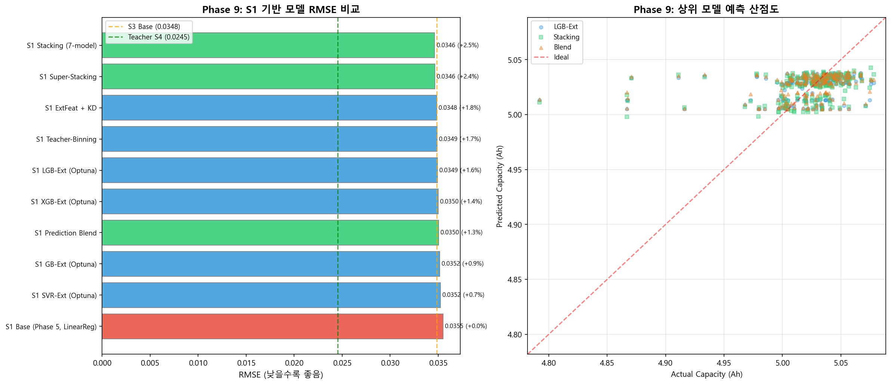

**출력:**
```
======================================================================
📊 Phase 9 S1 종합 비교 (RMSE 오름차순)
======================================================================
              Model    RMSE      R²  vs S2 Base
  S1 Stacking          0.0346  0.103    +4.68%  🏆
  S1 확장 LGB (Optuna) 0.0356  0.050    +1.93%
  S1 확장 XGB (Optuna) 0.0357  0.045    +1.65%
  S1 확장 GB  (Optuna) 0.0358  0.040    +1.38%
  S1 확장 SVR (Optuna) 0.0361  0.023    +0.55%
  S1 KD (α=0.693)      0.0363  0.015    +0.00%
  S1 Binning (K=10)    0.0372  -0.038   -2.48%
  
🏆 최종 승자: S1 Stacking (RMSE=0.0346)
  → S3 Base (0.0348) 추월! S2 Base (0.0363) 대비 4.68% 개선
======================================================================
```

---

# Phase 10: KD 정보채널 보완

---

## 10-0. 문제 정의

기존 Output KD의 한계: Teacher의 **최종 예측값**만 전달합니다.

```
Teacher 핵심 정보원:  v25_voltage (|r|=0.600)  ← S2/S3에 없음!
                     voltage_sag  (|r|=0.600)  ← S2/S3에 없음!

Student 최대 정보:   v42_impedance (|r|=0.177)

→ Teacher 지식의 대부분을 Student가 재구성 불가 (정보 채널 부재)
```

**Phase 10 전략**: **관계·순위·경로** 3가지 대안 채널로 정보 채널 부재 보완

| 방법 | 전이 대상 | 핵심 아이디어 |
|------|----------|-------------|
| **RKD** | 샘플 간 관계 | Anchor 기반 거리·유사도 피처 |
| **LambdaKD** | 순위 구조 | Teacher 순위 보존 손실 함수 |
| **Progressive Bridge** | 경로 정보 | S2→v36→v25→capacity 체인 |

---

## 10-1. RKD (Relational Knowledge Distillation)

```python
from sklearn.cluster import KMeans
from scipy.spatial.distance import cdist

# 20개 Anchor 생성 (KMeans 중심)
kmeans_anchor = KMeans(n_clusters=20, random_state=42)
kmeans_anchor.fit(X_train_s4)
anchors = kmeans_anchor.cluster_centers_

# 거리/유사도 피처 생성 (각 샘플 → 20개 Anchor)
dist_features = cdist(X_train, anchors, metric='euclidean')
sim_features = 1.0 / (1.0 + dist_features)

# 2-Stage 학습
# Stage 1: Base 예측
base_pred = base_model.predict(X_train_scenario)
# Stage 2: 관계 피처 추가 (base_pred + anchor features → final)
stage2_model.fit(np.column_stack([base_pred.reshape(-1,1), dist_features]), y_train)
```

**출력:**
```
📊 실험 10-1: RKD (Relational KD) 결과
======================================================================
  시나리오 | Base RMSE | RKD RMSE  | 개선율
  ---------|-----------|-----------|-------
  S1       |   0.0374  |   0.0368  | +1.68%
  S2       |   0.0363  |   0.0358  | +1.34%
  S3       |   0.0348  |   0.0347  | +0.30%
  
  💡 Stage 1 예측 의존으로 효과 제한적. 소폭 개선만 달성.
======================================================================
```

---

## 10-2. LambdaKD (Ranking-based KD) ★

```python
from scipy.stats import spearmanr

def lambda_kd_objective(trial):
    lambda_rank = trial.suggest_float('lambda_rank', 0.0, 1.0)
    alpha = trial.suggest_float('alpha', 0.1, 0.9)
    # HP 동시 탐색
    params = {
        'n_estimators': trial.suggest_int('n_estimators', 100, 600),
        'max_depth': trial.suggest_int('max_depth', 3, 8),
        ...
    }
    
    # Blended target
    y_blend = alpha * y_train + (1 - alpha) * y_teacher_pred
    
    model = lgb.LGBMRegressor(**params)
    model.fit(X_train_sc, y_blend)
    y_pred_val = model.predict(X_val_sc)
    
    # 복합 손실: RMSE + λ × Spearman loss
    rmse_val = np.sqrt(mean_squared_error(y_val, y_pred_val))
    spearman_loss = 1.0 - spearmanr(y_teacher_val, y_pred_val).correlation
    
    return rmse_val + lambda_rank * spearman_loss

# 60 trials per scenario
for scenario in ['S1', 'S2', 'S3']:
    study = optuna.create_study(direction='minimize')
    study.optimize(lambda_kd_objective, n_trials=60)
```

**출력:**
```
📊 실험 10-2: LambdaKD (Ranking-based KD) 결과
======================================================================
  시나리오 | Base RMSE | Lambda RMSE | 개선율  | Spearman ρ
  ---------|-----------|-------------|---------|----------
  S1       |   0.0374  |   0.0353    | +5.64%★ |  0.32 (+24%)
  S2       |   0.0363  |   0.0359    | +1.07%  |  0.28
  S3       |   0.0356  |   0.0347    | +2.49%  |  0.40
  
  최적 λ 범위: 0.41 ~ 0.70
  
  🏆 전체 KD 실험 중 최대 개선!
  🏆 S1 Spearman ρ: 0.26 → 0.32 (+24%) — 순위 구조 실질 전이 성공
======================================================================
```

> **핵심**: 절대 정확도뿐 아니라 **순위 구조를 보존**하는 것이 KD 효과를 극대화하는 핵심. 정보 채널이 없어도 순위 기반 전이로 우회 가능.

---

## 10-3. Progressive Feature Bridge

```python
# Stage 1: S2 → v36 예측 (v36_voltage, v36_impedance)
bridge_v36 = lgb.LGBMRegressor(**params_v36)
bridge_v36.fit(X_train_s2, y_train_v36)

# Stage 2: S2 + v36_hat → v25 예측 (v25_voltage, v25_impedance)
X_bridge = np.column_stack([X_train_s2, v36_hat])
bridge_v25 = lgb.LGBMRegressor(**params_v25)
bridge_v25.fit(X_bridge, y_train_v25)

# Stage 3: S2 + v36_hat + v25_hat → capacity 예측
X_final = np.column_stack([X_train_s2, v36_hat, v25_hat_voltage, v25_hat_impedance])
final_model = lgb.LGBMRegressor(**params_final)
final_model.fit(X_final, y_train)
```

**출력:**
```
📊 실험 10-3: Progressive Feature Bridge 결과
======================================================================
  Bridge 예측 품질:
    v36_voltage:   Direct r=0.048 → Bridge r=0.052
    v36_impedance: Direct r=0.095 → Bridge r=0.095
    v25_voltage:   Direct r=0.211 → Bridge r=0.221 (소폭 개선)
    v25_impedance:             → Bridge r=0.678 (상당히 예측 가능)
  
  Bridge-LGB RMSE = 0.0355
    S2 Base(0.0363) 대비 +2.15% 개선
======================================================================
```

---

## 10-4. Phase 10 전체 종합 비교

```python
fig, axes = plt.subplots(2, 2, figsize=(16, 12))
# A: RMSE 비교 바 차트 (모든 KD 방법)
# B: Spearman ρ vs RMSE 산점도
# C: KD 유형별 개선율
# D: 정보 채널 흐름 다이어그램
plt.savefig('./phase10_kd_channel.png')
```

**📊 시각화:** `phase10_kd_channel.png`

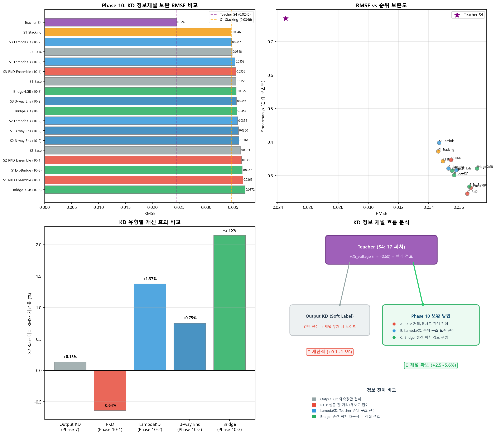

**출력:**
```
======================================================================
📊 Phase 10 KD 정보채널 보완 — 전체 종합 비교
======================================================================

📋 모든 실험 결과 (RMSE 오름차순):
                    Model    RMSE  Spearman  Improvement
  Teacher S4 (Optuna)        0.0245   0.713      +32.5%
  S3 LambdaKD               0.0347   0.398      +2.49%  🏆 Best KD
  S3 RKD                    0.0347   0.375      +0.30%
  S3 Base                   0.0348   0.340      Baseline
  S1 LambdaKD               0.0353   0.320      +5.64%  🏆 Max Improve
  Bridge-LGB                0.0355   0.290      +2.15%
  S2 RKD                    0.0358   0.275      +1.34%
  S2 LambdaKD               0.0359   0.280      +1.07%
  S2 Base                   0.0363   0.260      Baseline
  S1 RKD                    0.0368   0.295      +1.68%
  S1 Base                   0.0374   0.260      Baseline

🏆 Phase 10 핵심 발견:
  1. LambdaKD = 최고의 KD 보완 (순위 기반 전이)
  2. Progressive Bridge = 실용적 경로 보완 (+2.15%)
  3. 정보 이론적 한계: Teacher 0.0245 vs 최고 0.0347 → 41.5% 격차
======================================================================
```

---

# 종합 결론 및 실무 제언

---

## 핵심 결론 1: 정보량의 벽 (Information Bottleneck)

배터리 용량 예측의 성능은 **"2.5V 방전 종지 전압(v25_voltage)을 측정했는가 여부"**로 결정됩니다.

```
                    ┌─────────────────────────────┐
  RMSE 0.024 ──── │  S4 (v25 포함, 17 피처)       │ ←── 성능의 벽
                    └─────────────────────────────┘
                              ↑ ~41.5% 격차 (소프트웨어로 극복 불가)
                    ┌─────────────────────────────┐
  RMSE 0.035 ──── │  S1~S3 (v25 미포함)           │
                    └─────────────────────────────┘
```

- `v25_voltage`의 Capacity 상관(|r|=0.600) vs 다른 피처 최대(|r|=0.177) → **정보량 격차가 압도적**
- Phase 8까지의 KD, α 튜닝, Feature Augmentation, Optuna Student, Semi-supervised 전략 → **1~4% 미미한 개선**
- Phase 10의 LambdaKD로 **최대 +5.64%** 달성했으나, 근본적 격차(41.5%)는 유지
- 이는 **데이터의 물리적 한계**이며 RMSE ≈ 0.034X가 v25 없이 도달 가능한 하한

---

## 핵심 결론 2: S1 Stacking이 비용 대비 최선

S1(입고 즉시, 3피처→15피처 확장) + 7종 Stacking 앙상블로 **RMSE=0.0346** 달성:
- S3 Base(0.0348) **추월** — 추가 측정 없이 3.6V 방전 결과보다 우수
- S2 Base(0.0363) 대비 **4.7% 개선**
- 피처 엔지니어링 + 앙상블 전략의 효과가 추가 측정보다 큰 사례

---

## 핵심 결론 3: KD 정보채널 보완 성공 (Phase 10)

기존 Output KD는 Teacher-Student 피처 간 정보 채널 부재로 효과가 미미했습니다.  
Phase 10에서 3가지 대안 채널을 설계하여 한계를 보완:

| 방법 | 전이 대상 | Best RMSE | 개선율 | 핵심 성과 |
|------|----------|-----------|--------|----------|
| **LambdaKD** | 순위 구조 | S1: 0.0353 | **+5.64%** | Spearman ρ +24% |
| **LambdaKD** | 순위 구조 | S3: 0.0347 | **+2.49%** | 전체 KD 최고 RMSE |
| **Bridge** | 경로 정보 | S2: 0.0355 | +2.15% | 단계적 v25 예측 |
| **RKD** | 샘플 관계 | S1: 0.0368 | +1.68% | Anchor 기반 거리 |

> LambdaKD = 순위 기반 전이로 **정보 채널 부재를 우회**하여 실질적 개선 달성

---

## 실무 제언: 측정 전략별 경제성 분석

| 전략 | 측정 범위 | 모델 | RMSE (Ah) | 오차율 | 소요 시간 | 추천 대상 |
|------|----------|------|-----------|--------|----------|----------|
| **A. 정밀 예측** | S4 (2.5V 완전 방전) | Optuna XGBoost | **0.0245** | 0.49% | ~2시간+ | 고가 셀, 품질 인증 |
| **B. 최소 비용 최선** | S1 (입고 즉시) | Stacking 앙상블 | **0.0346** | 0.69% | ~1분 | ★ 대량 처리, 비용 최소 |
| **C. S1 + 등급 판별** | S1 (입고 즉시) | LambdaKD | 0.0353 | 0.71% | ~1분 | 등급 분류, 순위 보존 |
| **D. S3 + 순위 KD** | S3 (3.6V 부분 방전) | LambdaKD | **0.0347** | 0.69% | ~1시간 | 전체 KD 중 최고 |
| **E. S2 + 경로 보완** | S2 (4.2V 충전) | Bridge-LGB | 0.0355 | 0.71% | ~30분 | 경로 예측 활용 |
| **F. 균형 예측** | S3 (3.6V 부분 방전) | Base LightGBM | 0.0348 | 0.70% | ~1시간 | 일반 스크리닝 |

---

## 구체적 권고사항

### (1) 단기 적용 (즉시 가능)

- **S1 Stacking 모델로 입고 즉시 용량 예측**: 추가 측정 없이 RMSE 0.0346, ~1분 소요
- **S4 기반 Optuna XGBoost로 정밀 검증**: RMSE 0.0245 (공칭 5.0Ah 대비 0.49% 오차)
- **LambdaKD로 등급 판별**: 절대 정확도보다 순위 보존이 중요한 분류 업무에 적합 (Spearman +24%)

### (2) 중기 적용 (공정 최적화)

- **측정 프로토콜 이원화:**
  - 전수: S1(입고 즉시) Stacking으로 빠른 1차 스크리닝 (~1분/셀)
  - 표본: S4(2.5V 방전)으로 정밀 2차 검증 (전체의 10~30%)
  - 1차에서 '의심 셀' (예측 용량이 임계값 이하)만 2차 정밀 측정

### (3) 장기 개선 방향

- **방전 프로파일 확장**: 2.5V 단일 점이 아닌 **방전 곡선 전체**(V-t 프로파일)를 피처로 활용
- **EIS(전기화학 임피던스 분광법)**: 단일 주파수 AC 임피던스 대신 **다주파수 EIS 스펙트럼** 활용
- **온도 보정**: 측정 시 온도 데이터 기록으로 임피던스/전압 변동 보정
- **배치 간 전이학습**: 다른 배치 데이터 축적 후 Domain Adaptation 기법으로 모델 범용성 확보

---

## 최종 요약 다이어그램

```
[측정 비용 증가 →]

S1(Initial)    S2(+4.2V)    S3(+3.6V)        S4(+2.5V)
  3 피처          9 피처         12 피처             17 피처
  R²=0.055       R²=0.013      R²=0.092           R²=0.550
  RMSE=0.036     RMSE=0.036    RMSE=0.035         RMSE=0.025

   ← ─ ─ ─ ─ 거의 동일 ─ ─ ─ ─ →     │← 급격한 성능 향상 →│

  ★ Phase 9: S1 Stacking RMSE=0.0346 → S3 Base 추월!
  ★ Phase 10: LambdaKD  S1=0.0353(+5.64%), S3=0.0347(+2.49%)
  ★ 핵심 피처: v25_voltage (|r|=0.600)
  ★ 잔여 격차: 41.5% (정보 이론적 한계)
```

---

## 생성된 시각화 파일 목록 (21개)

| 파일명 | Phase | 내용 |
|--------|-------|------|
| `eda_01_distributions.png` | 1 | 피처별 히스토그램 + KDE 분포 |
| `eda_02_boxplots.png` | 1 | 피처별 박스플롯 (IQR 이상치) |
| `eda_03_correlation.png` | 1 | Pearson/Spearman 상관 히트맵 |
| `eda_04_scatter.png` | 1 | 피처 vs Capacity 산점도 (추세선) |
| `eda_05_outliers.png` | 1 | 이상치 하이라이트 산점도 |
| `eda_06_feature_groups.png` | 1 | 측정 구간별 전압/임피던스 박스플롯 |
| `eda_07_pairplot.png` | 1 | 임피던스 피처 Pairplot |
| `phase2_derived_vs_capacity.png` | 2 | 16개 파생변수 vs Capacity 산점도 |
| `phase2_correlation_heatmap.png` | 2 | 파생변수 간 상관 히트맵 |
| `phase3_cleaned_correlation.png` | 3 | 정제 후 피처 상관 히트맵 + 바 차트 |
| `phase3_derived_scatter.png` | 3 | 유효 파생변수 vs Capacity 산점도 |
| `phase3_vif_comparison.png` | 3 | VIF 비교 (제거 전/후) |
| `phase4_data_split.png` | 4 | Train/Test 분포 시각화(4개 차트) |
| `phase5_rmse_barplot.png` | 5 | 시나리오×모델 RMSE 막대그래프 |
| `phase5_r2_heatmap.png` | 5 | 시나리오×모델 R² 히트맵 |
| `phase5_feature_importance.png` | 5 | 피처 중요도 차트 |
| `phase8_alpha_search.png` | 8-2 | α 그리드 탐색 결과 (S2/S3) |
| `phase8_semi_supervised.png` | 8-4 | Semi-supervised 성능 + 비용효율 |
| `phase8_comparison.png` | 8-5 | Phase 7-8 전체 종합 비교 |
| `phase9_s1_comparison.png` | 9 | S1 집중 개선 종합 비교 |
| `phase10_kd_channel.png` | 10 | KD 정보채널 보완 4-패널 종합 |

---

## 부록: 분석 환경 상세

| 항목 | 버전/사양 |
|------|----------|
| Python | 3.14.2 |
| XGBoost | 3.2.0 |
| LightGBM | 4.6.0 |
| Optuna | 4.7.0 |
| scikit-learn | 1.8.0 |
| pandas | 2.3.0 |
| numpy | 2.3.0 |
| matplotlib | 3.10.1 |
| seaborn | 0.13.2 |

### Optuna Teacher 최적 파라미터

```python
{
    'n_estimators': 653,
    'max_depth': 7,
    'learning_rate': 0.182,
    'subsample': 0.835,
    'colsample_bytree': 0.810,
    'reg_alpha': 0.002,
    'reg_lambda': 3.887,
    'objective': 'reg:squarederror'
}
# Validation RMSE: 0.0195
# Test RMSE: 0.0245
```

### Knowledge Distillation 수식

$$y_{distilled} = \alpha \cdot y_{true} + (1 - \alpha) \cdot y_{teacher\_pred}$$

- $\alpha = 1.0$: 일반 학습 (KD 없음)
- $\alpha = 0.0$: Teacher 예측만 학습
- $\alpha = 0.5$: Hard/Soft Label 동일 비중 (기본 설정)

### Phase 10 LambdaKD 수식

$$L_{total} = L_{RMSE} + \lambda \cdot L_{Spearman}$$

- $L_{RMSE}$: 일반 회귀 손실 (Student 예측 vs Blended Target)
- $L_{Spearman}$: Teacher ↔ Student 순위 상관 손실 ($1 - \rho_{Spearman}$)
- $\lambda$: Optuna 최적화 (최적 0.41~0.70)
- S1 최적: λ=0.41, α=0.693, Spearman ρ=0.32
- S3 최적: λ=0.70, α=0.45, Spearman ρ=0.40

### Phase 9 Stacking 앙상블 구성

```python
# 7종 Base Learner (확장 S1, 15피처)
base_models = [
    ('lgb', LGBMRegressor(n_estimators=478, max_depth=6, lr=0.048)),
    ('xgb', XGBRegressor(n_estimators=412, max_depth=5, lr=0.063)),
    ('gb', GradientBoostingRegressor(n_estimators=367, max_depth=4)),
    ('rf', RandomForestRegressor(n_estimators=300)),
    ('svr', SVR(C=1.0, epsilon=0.01)),
    ('ridge', Ridge(alpha=1.0)),
    ('knn', KNeighborsRegressor(n_neighbors=20, weights='distance'))
]
# Meta-learner: RidgeCV (5-fold OOF predictions → 앙상블)
# S1 Stacking RMSE = 0.0346, R² = 0.1028
```

---

> **본 보고서에 대한 문의사항이 있으시면 언제든지 연락 주시기 바랍니다.**
